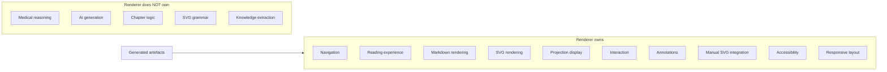

# Renderer V2 — Vision

> Parent: [README.md](./README.md)  
> Upstream: [`00-foundation/vision.md`](../../00-foundation/vision.md), [`IMPLEMENTATION_CONTRACT.md`](../../IMPLEMENTATION_CONTRACT.md) Part B

---

## What the renderer is

The renderer is Lou Médecine's **educational application** — the surface through which a medical student reads, navigates, and appropriates generated learning material.

It is not a diagram tool. It is not a markdown viewer. It is the **intelligent medical textbook** that presents everything the build pipeline produces: projections, official visuals, traceability, and — separately — the learner's personal layer.

Everything the renderer displays arrives as **generated artefacts**. The renderer interprets structure (blocks, links, availability states); it never interprets medicine.

---

## What the renderer is not

The renderer must never be mistaken for:

| Not this | Because |
|---|---|
| **ChatGPT** | No generation, no conversational interface, no medical answers |
| **Google Docs** | No collaborative editing, no document mutation, no revision history on official content |
| **Notion** | No free-form blocks, no user-authored curriculum, no database of medical facts |
| **A CMS** | No content authoring, no publishing workflow, no editorial roles |
| **A word processor** | No rich-text editing of official content; annotations are overlays, not edits |
| **A visual editor** | SVGs are consumed, not authored in the browser |
| **An AI tutor** | No adaptive dialogue, no personalised medical explanations (adaptivity is a future layer reading events, not rewriting content) |

These boundaries are intentional. Each excluded capability would blur the immutability invariant and multiply maintenance cost across 350 chapters.

---

## Design philosophy

### An exceptionally well-designed paper course

Lou studies on paper. She highlights, underlines, draws diagrams in the margin, and writes notes beside paragraphs. The digital experience should feel like **reading an exceptionally well-designed paper course** — not like using productivity software.

Properties of this feeling:

- **Typography-first.** Prose is the primary medium. Visuals support; they do not replace explanation.
- **Predictable structure.** Every mechanism block follows the same shape: question → optional visual → walkthrough. The learner never hunts for where the explanation lives.
- **Calm technology.** No chat bubbles, no AI sparkle icons, no "generate summary" buttons on official content. The build did the work; the renderer presents it faithfully.
- **Personal without polluting.** Highlights and notes live in a separate layer — like pencil marks on a textbook you own, not edits to the publisher's PDF.

### Understanding before memorisation

The renderer serves **Phase 2** of the learning journey ([`00-foundation/vision.md`](../../00-foundation/vision.md)): deep understanding. Mastery projections (QCM, flashcards) will arrive later as a separate projection family. The renderer discovers them from the manifest; it does not hard-code tab names.

The pedagogical block — question, optional visual, walkthrough — encodes this priority. The walkthrough is canonical; the visual is optional support ([`IMPLEMENTATION_CONTRACT.md`](../../IMPLEMENTATION_CONTRACT.md) Part B).

### Technology disappears behind learning

Implementation choices (vanilla JS, IndexedDB, CSS Custom Highlights) exist to serve reliability and longevity, not to showcase engineering. A student opening a chapter should think about cardiology, not about the application.

---

## Renderer V2 — what changes

Renderer V1 (`demo/renderer/`) already implements the core contract: manifest-driven navigation, pedagogical blocks, official visuals by ID, traceability panel, Personal Diagrams, Inline Notes at claim-block boundaries.

Renderer V2 extends the product without breaking invariants:

| V1 (implemented) | V2 (target) |
|---|---|
| Inline Notes at claim-block boundaries | **Text selection annotations** — highlight, emphasis, colours, inline margin notes anchored to selected text |
| Personal Diagrams (photo upload) | Unchanged — separate mechanism |
| Official SVG as `` | Responsive SVG display, zoom, future overlay annotations |
| Static vanilla shell | Same stack — evolved modules, not framework rewrite |
| Legacy fallback to `generated-assets/` | Removed once all active chapters are built |
| Basic traceability panel | Enhanced source reading experience |

Renderer V2 is **evolution**, not greenfield. The migration plan ([10-MIGRATION_PLAN.md](./10-MIGRATION_PLAN.md)) preserves a functional repository at every step.

---

## Success criteria

A new contributor reading this vision should conclude:

1. The renderer is the **student-facing application**, not the build pipeline.
2. Official content is **read-only**; personal appropriation happens in a **separate layer**.
3. The experience should feel like a **premium textbook**, not productivity software.
4. V2 adds **annotation richness** without becoming an editor.
5. Every architectural choice optimises **long-term maintainability** over cleverness.
