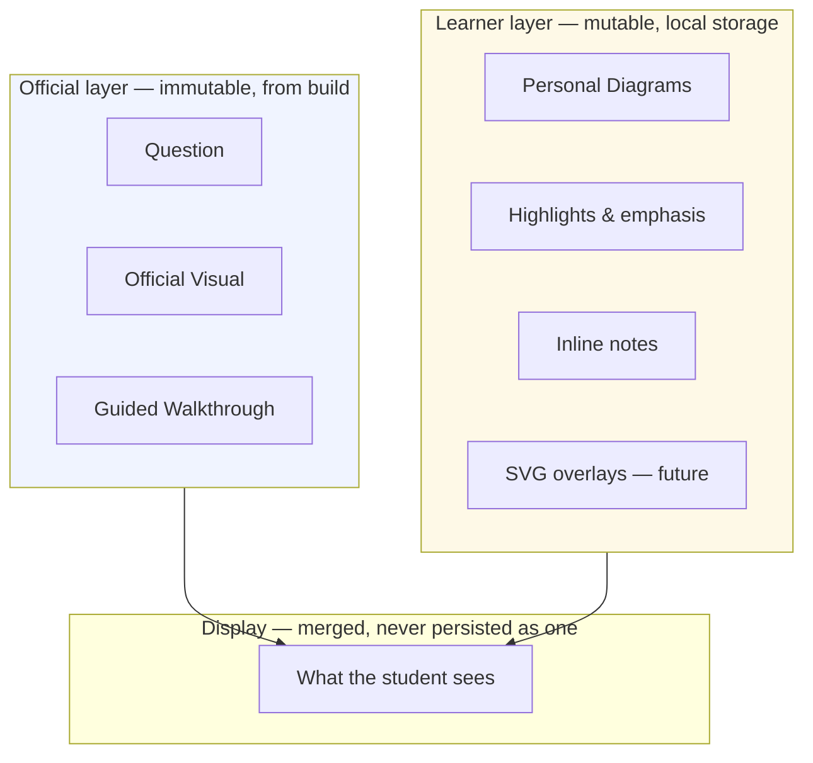
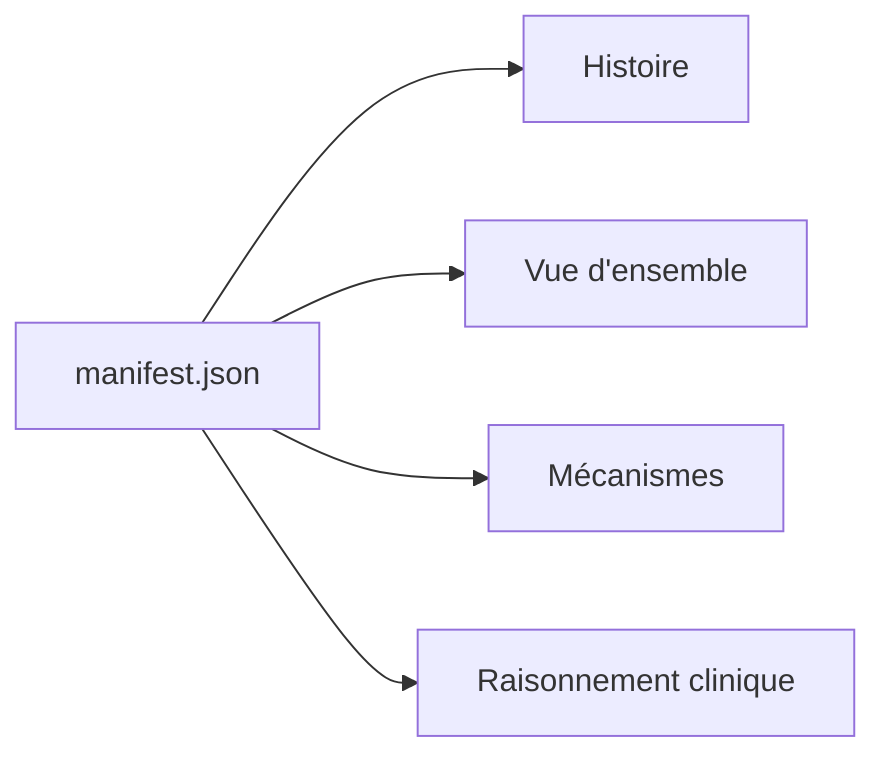
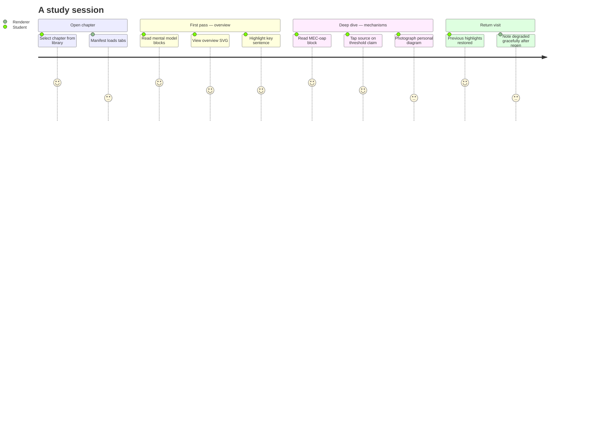

# Renderer V2 — Product Specification

> Parent: [README.md](./README.md)  
> Contractual obligations: [`IMPLEMENTATION_CONTRACT.md`](../../IMPLEMENTATION_CONTRACT.md) C.7–C.9

This document describes the **complete learner experience** — what a student sees and does — without prescribing implementation.

---

## The immutability invariant

> **Official educational content is immutable.**

The renderer:

- **Never edits** official content
- **Never rewrites** official content
- **Never stores modified versions** of official content

Only generated artefacts are rendered. Personal annotations, highlights, and diagrams are stored in a **separate learner layer** and merged at display time. The official layer and the learner layer are visually distinct.



This invariant is non-negotiable. It is what separates Lou from Google Docs and what makes regeneration safe: the build can replace any projection; learner data survives because it never modified the projection.

---

## Chapter entry

A student opens a chapter by URL:

```
index.html?chapter=cardio/234
```

The renderer:

1. Resolves the chapter path (canonical `chapters/` first; legacy alias if needed)
2. Fetches `manifest.json`
3. Builds navigation from `manifest.projections[]` sorted by `order`
4. Displays chapter metadata: specialty, title, read time, objectives

If no manifest exists, the renderer shows an explicit notice that content predates the current architecture. It does not silently serve untraced material without warning.

---

## Navigation model

### Projection tabs

Each projection in the manifest becomes a tab. Tab labels, order, and availability come from the manifest — never from hard-coded registries.



Future projection types (readiness, actors, mastery QCM) appear as new tabs when the manifest declares them. The renderer requires no code change per projection type — only a rendering capability for the projection's block structure.

### Within a projection

Content is a **sequence of pedagogical blocks**, one per Blueprint element:

```
┌─────────────────────────────────────────────────────────┐
│  Question                                    (required) │
├─────────────────────────────────────────────────────────┤
│  Official Visual                             (optional) │
│    — published / withheld / planned-not-built / absent  │
├─────────────────────────────────────────────────────────┤
│  📷 Personal Diagram affordance              (always)   │
├─────────────────────────────────────────────────────────┤
│  Guided Walkthrough                          (required) │
│    — selectable text, annotations, source buttons       │
├─────────────────────────────────────────────────────────┤
│  📝 Note affordances at claim-block boundaries          │
└─────────────────────────────────────────────────────────┘
```

A preamble may precede the first block (overview introductions, framing paragraphs). The renderer never invents blocks for unstructured content.

### Learning order

When the manifest includes a Blueprint sequence, navigation respects pedagogical order within projections. Cross-projection order follows manifest `order` fields.

---

## Reading experience

### Typography and layout

- Comfortable reading width (≈ 65–75 characters per line on desktop)
- Clear hierarchy: question as block header, walkthrough as body prose
- Generous vertical rhythm between blocks
- Dark mode support (future — not blocking V2 core)

### Source traceability

Claim blocks that reference knowledge points expose a **source** affordance. Activating it opens a panel showing:

- The verbatim source quote
- Section path in the official college text
- Knowledge point identifier

The student answers "where does this come from?" without leaving the reading flow. The renderer performs a lookup against `build/traceability.json`; it does not interpret medical content.

### Edition badges

When content was updated in a new college edition, the manifest surfaces derived badges (`new`, `updated`, `unchanged`, `removed`). The renderer displays them; it does not compute edition diffs.

---

## Official visuals in context

Each block's Official Visual is bound by **Blueprint element ID**, never by position in the document.

Three availability states must remain distinguishable:

| State | Student sees |
|---|---|
| **Published** | The figure with manifest-supplied alt text |
| **Planned, not built** | Explicit notice: visual planned, not yet available |
| **Built but withheld** | Explicit notice: visual temporarily unavailable (validation failure) |
| **None planned** | Nothing — no gap implied, walkthrough stands alone |

See [05-SVG_EXPERIENCE.md](./05-SVG_EXPERIENCE.md) for SVG-specific behaviour.

---

## Manual and generated SVGs

Both coexist under the same Official Visual slot:

- **Generated SVGs** — produced by `lou-build` from visual specifications; deterministic, ID-bound
- **Manual SVGs** — hand-authored files checked into `figures/` where pedagogically justified (complex anatomical schematics, one-off illustrations)

The renderer chooses the appropriate asset from the manifest path. It does not know or care how the SVG was produced.

---

## Learner layer — three separate mechanisms

### Personal Diagrams (existing)

On every block, regardless of whether an Official Visual exists:

- Student photographs their own drawing
- Image stored locally, anchored to Blueprint element ID
- Visually distinct from official content
- Never read by any AI or build process

### Inline Notes (existing, evolving)

At claim-block boundaries within walkthroughs:

- Short text notes anchored to `(elementId, claimBlockId)`
- Survive minor regeneration when claim block persists
- Degrade to block level when claim block is re-cut

### Text selection annotations (V2)

Within the walkthrough prose:

- Select text → floating toolbar appears
- Apply: highlight (≈5 colours), bold, italic, strike-through, text colour
- Attach selection note to selected text
- Remove any annotation individually

Annotations are overlays. They never modify the DOM text nodes of official content permanently — see [06-ANNOTATION_SYSTEM.md](./06-ANNOTATION_SYSTEM.md).

---

## Degradation and honesty

The renderer surfaces problems rather than hiding them:

| Situation | Behaviour |
|---|---|
| Projection not yet built | Known-absent state tied to pipeline status |
| Visual withheld | Explicit "temporarily unavailable" message |
| Learner note anchor lost | Note moves to block level with marker |
| Learner artifact orphaned | Orphan panel — nothing silently deleted |
| Legacy content fallback | Banner: content predates architecture |

---

## Accessibility

- All Official Visuals carry manifest-supplied alt text (never renderer-authored)
- Semantic HTML from markdown rendering (`<article>`, headings, lists)
- Keyboard navigation for tabs and source panel
- Annotation toolbar keyboard-accessible
- SVG `<title>` and `<desc>` from generation pipeline
- Reduced motion preference respected for transitions

---

## Responsive behaviour

| Viewport | Behaviour |
|---|---|
| Desktop | Side-by-side potential for source panel; full visual width |
| Tablet | Stacked layout; touch-friendly annotation toolbar |
| Mobile | Single column; SVG scales to container; pinch-zoom on figures |

The renderer is a reading application, not a native app. Progressive enhancement over mobile browsers is sufficient for V2.

---

## Future projections

When mastery projections arrive (QCM, flashcards), they appear as manifest-declared tabs with family tag `mastery`. The renderer renders them with appropriate interaction (question/answer reveal) without conflating them with understanding projections.

Adaptivity (spaced repetition, sequencing) reads learner events from a future layer. The renderer emits events; it does not implement adaptive algorithms.

---

## Experience summary



The renderer's job is to make each step frictionless while keeping official content pristine.
