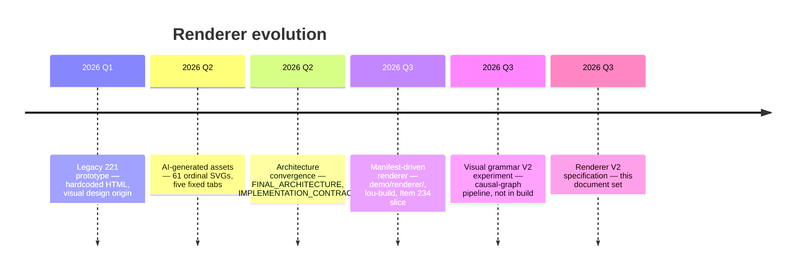
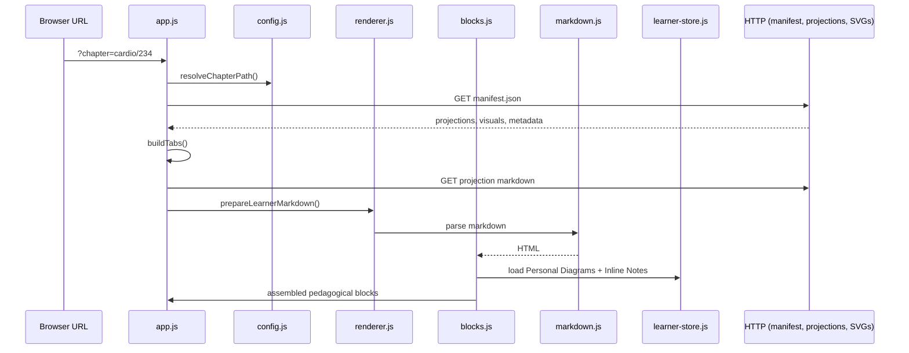
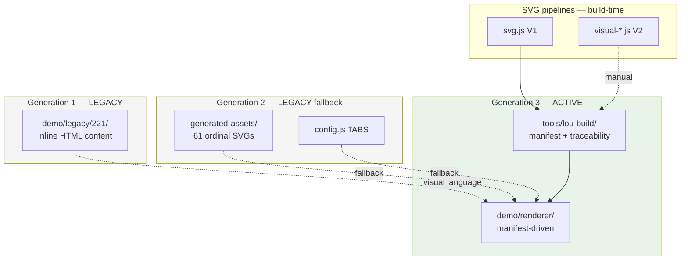

# Renderer — Historical Architecture

> Parent: [README.md](./README.md)  
> Purpose: Document where we come from — not criticism, but context for migration decisions.

---

## Timeline



---

## Generation 1 — Legacy prototype (`demo/legacy/221/`)

### How it worked

A single HTML page with five hard-coded tabs. Medical content lived **inside the renderer** as inline HTML string literals in `app.js`. One overview SVG was embedded directly.

```
demo/legacy/221/
  index.html    — shell
  app.js        — tabs + inline medical HTML
  assets/svg/   — cardio-221-overview.svg (design seed)
```

### Strengths

- Established the **visual language** Lou responded to: card-based diagrams, colour tokens, pedagogical block rhythm
- Proved that a static shell without a framework could feel polished
- `cardio-221-overview.svg` became the ancestor of `templates/svg/diagram-template.svg`

### Limitations

- Medical content in JavaScript — every chapter required renderer changes
- No traceability, no manifest, no separation of concerns
- Not scalable beyond a demo chapter

### Why it was designed this way

At project inception, the priority was **visual and pedagogical validation** with Lou, not architecture. Embedding content was the fastest path to a testable reading experience.

### Why it no longer matches Lou architecture

The convergence decision ([`FINAL_ARCHITECTURE.md`](../../FINAL_ARCHITECTURE.md)) requires the renderer to hold **zero medical content**. Legacy 221 violates this permanently. It remains only as design archaeology.

**Status:** LEGACY — retire after visual tokens are fully documented in the active design system.

---

## Generation 2 — AI-generated assets era

### How it worked

An LLM prompt (`templates/prompt/generate-svg.md`) produced prose assets and 61 SVG files per chapter, stored in `01-learning/generated-assets/`:

```
generated-assets/cardio/234-insuffisance-cardiaque/
  histoire.md, mecanismes.md, vue-ensemble.md, ...
  figures/
    mechanism-01.svg … mechanism-24.svg
    actor-01.svg … actor-36.svg
    overview.svg
```

The early renderer (pre-manifest) used a hard-coded `TABS` registry in `config.js` mapping tab names to these files. SVGs linked by **ordinal position** — `mechanism-03.svg` implicitly meant "third mechanism heading."

### Strengths

- Demonstrated that AI could produce **visually coherent** diagram sets at scale
- Generated rich mechanism prose that seeded the Item 234 Blueprint
- `svg-generation-review.md` captured integration-test findings

### Limitations

- **Ordinal fragility** — renaming or reordering mechanisms broke visual links
- **No traceability** — assets self-declared `✅ 100%` without independent verification
- **Prose as structure** — diagrams derived from finished markdown, not structured step graphs
- **One card-stack template** — 61 SVGs share one visual pattern with different labels

### Why it was designed this way

Before Inventory and Blueprint existed, the workflow was: coverage checklist → storyboard stub → generate five assets → generate SVGs from prose. This matched Architecture A in the audit — fast to demo, structurally unable to scale.

### Why it no longer matches Lou architecture

- Visuals must bind by **element ID**, not ordinal
- SVGs must generate from **visual specifications**, not prose interpretation
- Content must pass **grounding and reconciliation** before publication
- The renderer must discover tabs from **manifest**, not `config.js`

**Status:** LEGACY fallback — `demo/renderer/` still reads `generated-assets/` when no manifest exists, with an explicit deprecation notice. Remove fallback after all active chapters are built.

---

## Generation 3 — Current renderer (`demo/renderer/`)

### How it works



**Module responsibilities:**

| Module | Role |
|---|---|
| `index.html` | Shell, script load order |
| `config.js` | Path resolution, legacy slug aliases, `TABS` fallback |
| `app.js` | Boot, tab UI, chapter loading orchestration |
| `renderer.js` | Fetch helpers, markdown prep, traceability panel, visual state notices |
| `markdown.js` | Thin `marked` wrapper |
| `blocks.js` | Pedagogical block assembly, visual binding by ID, learner affordances |
| `learner-store.js` | IndexedDB: Personal Diagrams + Inline Notes |
| `styles.css` | Layout, block styling, learner layer distinction |

**Data inputs:**

- `01-learning/chapters/{chapter}/manifest.json`
- Projection markdown files referenced by manifest
- `figures/*.svg` referenced by manifest visual links
- `build/traceability.json` (on demand)

**No build step** for the renderer itself. Served as static files via HTTP.

### Strengths

- **Manifest-driven** — new chapters need no renderer code changes
- **Contract-tested** — `test/renderer.test.js` verifies block structure, visual binding, three visual states, learner affordances, degradation cases
- **Chapter-agnostic** — no medical strings in renderer code
- **Clean separation** — renderer consumes IDs and paths; never interprets medicine
- **Offline-capable** — vendored `marked`, no CDN dependency
- **Learner layer implemented** — Personal Diagrams and Inline Notes with honest degradation

### Limitations

- **No text-selection annotations** — only claim-block boundary notes
- **SVG as static ``** — no zoom, no overlay annotations
- **Legacy fallback still present** — `config.js` TABS and `generated-assets/` path
- **No production deploy pipeline** — manual `python3 -m http.server`
- **Monolithic globals** — `window.LouConfig`, `window.LouBlocks`, etc.; workable but not modularised
- **Basic reading UX** — no dark mode, limited responsive polish

### Why it was designed this way

[`REFERENCE_IMPLEMENTATION_DESIGN.md`](../../REFERENCE_IMPLEMENTATION_DESIGN.md) §12 explicitly chose the existing static shell: "clean separation, chapter-agnostic, path-sanitized, offline marked — sufficient to grow into this contract, and the choice stays reversible."

The OAP vertical slice ([§17]( ../../REFERENCE_IMPLEMENTATION_DESIGN.md)) validated the architecture before investing in framework selection.

### Alignment with current architecture

Generation 3 **implements** the renderer contract (C.7–C.9). It is not a prototype awaiting replacement — it is the foundation Renderer V2 extends.

**Status:** ACTIVE — authoritative browser implementation.

---

## Parallel concern — SVG build pipelines (not the browser renderer)

These are often confused with "Renderer V2" but belong to `tools/lou-build/`:

### V1 — `svg.js` (process-flow)

- Integrated into `lou-build build`
- Hard-coded card layout for `process-flow` primitive
- Chapter-specific strings (OAP threshold labels)
- Produces `figures/mec-oap.svg` for Item 234
- Marked `@deprecated` for `renderMecOapSvg` alias

**Status:** ACTIVE transitional — violates grammar contract I3 (geometry in renderer); replace with V2 pipeline.

### V2 — `visual-spec.js` → `visual-render.js` (causal-graph)

- Schema validation, semantic grounding gate, deterministic layout
- Subject-matter-agnostic tokens
- Manual invocation via `render-visual-specs.mjs` — **not in build**
- One committed output: `mm-pump-decompensation.svg`

**Status:** EXPERIMENTAL — target SVG pipeline; not yet authoritative for packaging.

---

## Documentation drift

Several root documents predate Generation 3:

| Document | Stale claim |
|---|---|
| `ARCHITECTURE_AUDIT.md` | Renderer never loads SVGs; hard-coded tabs |
| `README.md` | "Validate methodology before building software" |
| `CURRENT_PRIORITIES.md` | Product discovery phase |
| `03-architecture/README.md` | Empty stub |

These are forensic records, not operational guides. [`docs/renderer/README.md`](./README.md) supersedes them for renderer orientation.

---

## Historical architecture diagram



---

## Lessons carried forward

1. **Never embed medical content in the renderer** — Generation 1's fatal flaw
2. **Never link visuals by ordinal** — Generation 2's fatal flaw
3. **Manifest is the contract** — Generation 3's enduring principle
4. **Keep the shell simple** — vanilla static served the slice well
5. **Separate build-time SVG from browser rendering** — two different "renderers", one product
