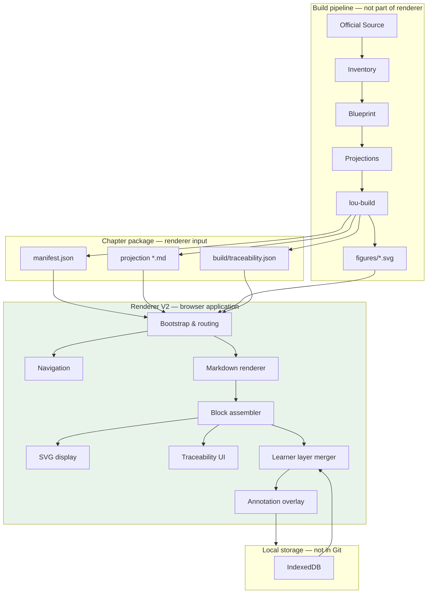
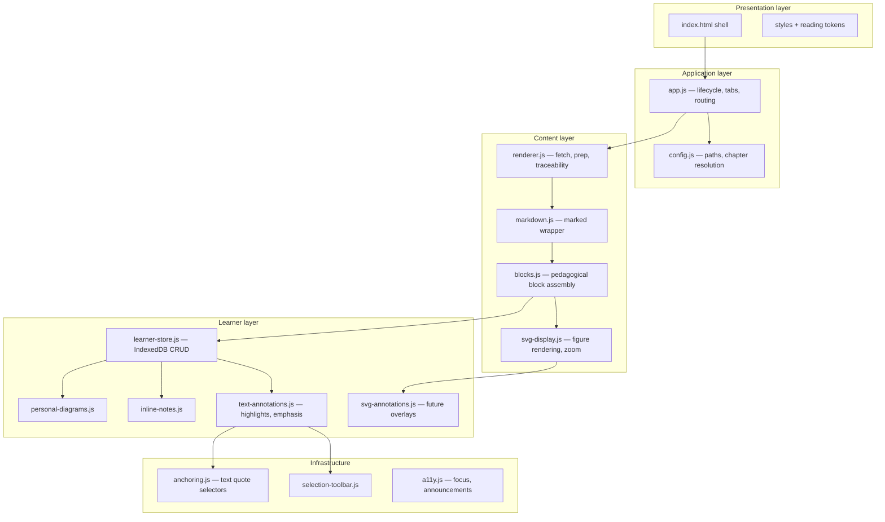
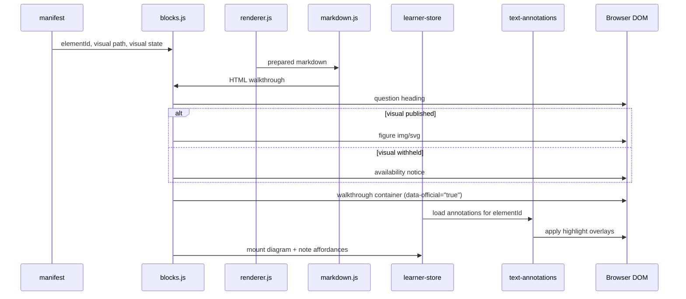
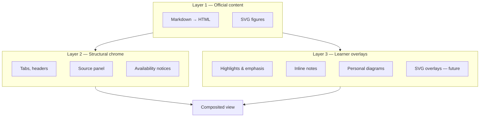
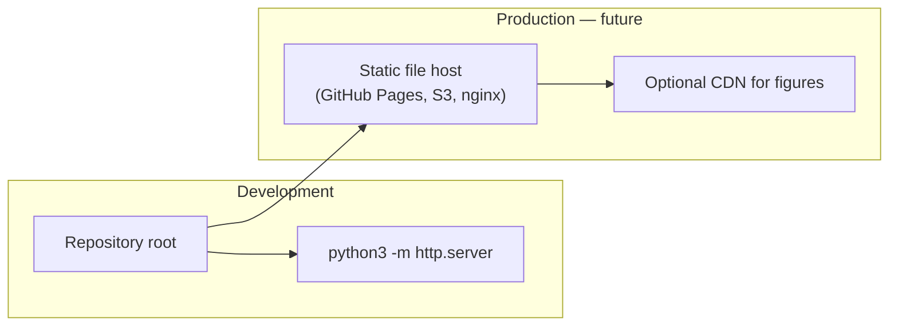

# Renderer V2 — Target Architecture

> Parent: [README.md](./README.md)  
> Contract: [`IMPLEMENTATION_CONTRACT.md`](../../IMPLEMENTATION_CONTRACT.md) C.7; [`REFERENCE_IMPLEMENTATION_DESIGN.md`](../../REFERENCE_IMPLEMENTATION_DESIGN.md) §12

This is the **reference architecture** for the Lou Médecine browser renderer. It should remain valid for years. Implementation details may evolve; the component boundaries and data flows defined here should not.

---

## System context

The renderer is a **read-only consumer** of the chapter package plus a **read-write owner** of learner-local data.

---

## Component architecture

Module paths below are logical names; physical layout may remain flat until Phase 6 ([11-REPOSITORY_CLEANUP.md](./11-REPOSITORY_CLEANUP.md)).

**V2 modularisation note:** Generation 3 colocates learner concerns in `blocks.js` and `learner-store.js`. V2 extracts annotation logic into dedicated modules without requiring a bundler initially — ES modules can be adopted incrementally when a build step is introduced.

---

## Data flow — rendering a block

Critical invariant: official HTML is rendered first from markdown; annotations are applied as a **second pass** over a marked container. Official DOM text nodes are never mutated to add bold or colour.

---

## Component specifications

### Bootstrap & routing (`app.js`)

- Parse `?chapter=` URL parameter
- Resolve chapter path (canonical → legacy alias → error)
- Fetch manifest; build tab UI from `projections[]`
- Load active projection on tab select
- Emit learner events (tab viewed, source opened) for future adaptivity
- Handle fatal errors with actionable messages

### Configuration (`config.js`)

- `ASSETS_ROOT` resolution relative to page URL
- Legacy slug aliases (`234-insuffisance-cardiaque` → `234`)
- **V2:** remove `TABS` fallback once migration complete
- Messages and labels (French UI chrome)

### Markdown renderer (`markdown.js`)

- Parse markdown to HTML via `marked`
- Preserve Blueprint element anchors as block boundaries
- Convert claim-block markers to source buttons
- Strip front matter and internal trace metadata

### Block assembler (`blocks.js`)

- Group HTML into pedagogical blocks by element ID
- Inject Official Visual by manifest link (never ordinal)
- Render three visual availability states distinctly
- Mount learner affordances on every block
- Handle preamble content outside blocks

### SVG display (`svg-display.js` — V2 extraction)

- Render published visuals as responsive `` or inline `<svg>` where DOM access needed
- Pinch/click zoom for complex figures
- Respect `prefers-reduced-motion`
- Pass through alt text from manifest only

### Traceability UI (`renderer.js`)

- Fetch `build/traceability.json` on demand
- Slide-over panel with source quote, section path, KP ID
- No medical interpretation — pure lookup

### Learner store (`learner-store.js`)

- IndexedDB with namespaced stores per chapter
- CRUD for Personal Diagrams, Inline Notes, Text Annotations
- Schema versioning for forward migration
- Export/import for backup (future)

### Text annotations (`text-annotations.js` — V2)

- Listen for selection within `[data-official="true"]` containers
- Show floating toolbar
- Persist annotation records; reapply on load
- See [06-ANNOTATION_SYSTEM.md](./06-ANNOTATION_SYSTEM.md)

### SVG annotations (`svg-annotations.js` — future)

- SVG overlay layer above official figure
- Pointer events on overlay only
- See [07-SVG_ANNOTATIONS.md](./07-SVG_ANNOTATIONS.md)

---

## Layer model

Layers 1 and 3 are **never merged in storage**. Layer 3 is recomputed on every render from IndexedDB records applied to Layer 1 DOM.

---

## Boundaries — what the renderer must never do

| Forbidden | Reason |
|---|---|
| Fetch Inventory or Blueprint directly | Violates manifest-as-contract |
| Compose or paraphrase walkthrough text | C.7 — renderer holds no medical content |
| Author alt text for visuals | Alt comes from manifest (grammar contract I1) |
| Modify projection files | Immutability invariant |
| Send learner content to build/AI | Learner layer boundary (Part B) |
| Assume fixed tab count or projection types | Manifest-driven discovery |
| Link SVGs by ordinal position | ID binding only |

---

## Deployment architecture

V2 does not require server-side rendering. The renderer is static files + HTTP fetch of chapter artefacts. Production deployment is a static hosting concern, not an application architecture change.

---

## Testing architecture

| Layer | Test approach |
|---|---|
| Block assembly | jsdom unit tests (existing) |
| Visual binding | Contract tests against fixture manifest |
| Annotation anchoring | jsdom + fixture HTML; round-trip selector tests |
| Learner store | fake-indexeddb |
| Integration | Manual chapter load + automated smoke script (future) |

Tests live alongside the renderer (`apps/renderer/test/` after migration). They verify **contract compliance**, not medical correctness.

---

## Evolution path within this architecture

Changes that fit without architectural revision:

- ES module migration
- Dark mode
- Service worker for offline chapter cache
- Event emission to adaptivity layer
- SVG overlay annotations
- Export learner data

Changes that require ADR amendment:

- Framework adoption (React, Svelte)
- Server-side rendering
- Collaborative annotations
- Editing official content
- Storing learner data in Git

See [12-NON_GOALS.md](./12-NON_GOALS.md) for permanently excluded capabilities.
