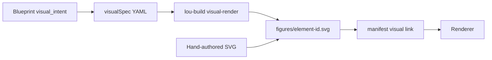
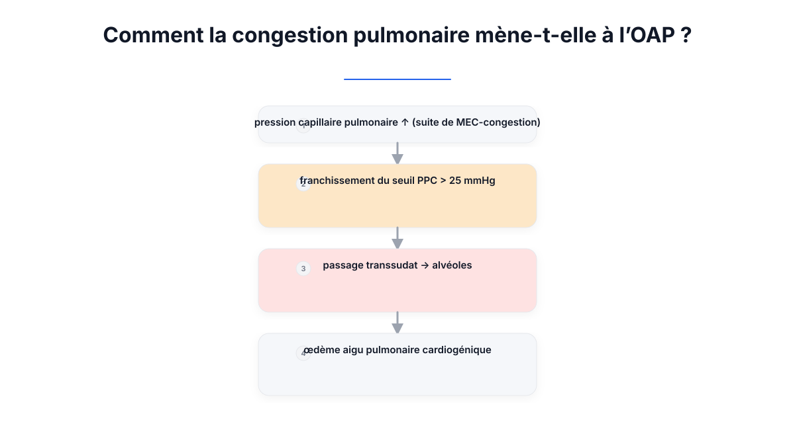
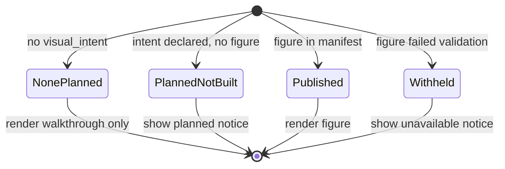
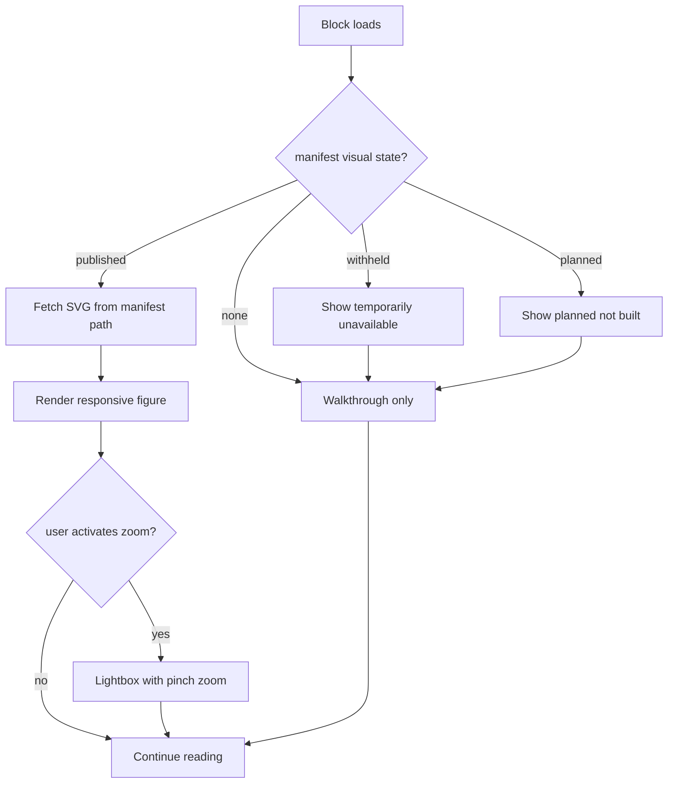

# Renderer V2 — SVG Experience

> Parent: [README.md](./README.md)  
> Grammar authority: [`VISUAL_GRAMMAR_LIBRARY.md`](../../VISUAL_GRAMMAR_LIBRARY.md), [`VISUAL_GRAMMAR_CONTRACT.md`](../../VISUAL_GRAMMAR_CONTRACT.md)

---

## Philosophy

Official Visuals are **optional pedagogical support**, never the primary explanatory artifact ([`IMPLEMENTATION_CONTRACT.md`](../../IMPLEMENTATION_CONTRACT.md) Part B). The SVG experience serves understanding — it does not replace the Guided Walkthrough.

Two sources of SVG coexist:

| Source | When used | Properties |
|---|---|---|
| **Generated SVG** | Blueprint declares `visual_intent`; build produces specification → SVG | Deterministic, ID-bound, traceable, regenerable |
| **Manual SVG** | Pedagogically justified cases where generation is impractical | Hand-authored, checked into `figures/`, manifest-linked by element ID |

The renderer **chooses the appropriate asset from the manifest**. It does not distinguish generated from manual in the UI — both are Official Visuals.



---

## Generated SVGs

### Pipeline (target state)

1. Blueprint element declares `visual_intent` (e.g. `causal-graph`, `process-flow`)
2. Build generates or validates `visualSpec` YAML
3. Grounding gate confirms semantic eligibility
4. Layout engine computes deterministic positions
5. Render engine emits SVG with `data-blueprint-element`, `data-primitive`, KP references
6. Manifest publishes path and alt text

### Current state (transitional)

- **V1** (`svg.js`): only `process-flow`; integrated in build; hard-coded layout
- **V2** (`visual-render.js`): only `causal-graph`; manual script; one figure committed

See [03-HISTORICAL_ARCHITECTURE.md](./03-HISTORICAL_ARCHITECTURE.md) for pipeline details.

### Renderer consumption

Published visuals render as:

```html
<figure class="official-visual" data-element="MEC-oap">
  
</figure>
```

- Alt text comes **only** from manifest — renderer never authors it
- Element ID on figure matches Blueprint element for accessibility and future overlay anchoring
- Inline SVG embedding is reserved for cases requiring DOM access (zoom, overlay) — opt-in per figure

---

## Manual SVGs

### When manual SVGs are justified

- Complex anatomical schematics where grammar primitives do not apply
- One-off illustrations produced by a medical illustrator
- Interim figures while generated pipeline catches up on a primitive
- `annotated-figure` base artwork (annotation layer is spec-owned; pixels are manual)

### Requirements for manual SVGs

| Requirement | Rationale |
|---|---|
| Filename matches element ID | ID binding invariant |
| Valid SVG with `<title>` and `<desc>` | Accessibility |
| Design tokens from `design-system.md` | Visual consistency |
| Checked into `figures/` alongside generated | Single asset location |
| Declared in manifest with alt text | Renderer contract |

Manual SVGs are **not** second-class. They are Official Visuals with a different production path. Manual SVGs are exceptions at the manifest level; they never substitute for the visual-spec generation pipeline where a grammar primitive applies.

---

## Availability states — four outcomes

The renderer must distinguish four availability outcomes ([`IMPLEMENTATION_CONTRACT.md`](../../IMPLEMENTATION_CONTRACT.md) C.6 defines three absence/withheld reasons; published is the fourth):



**Never collapse states.** A student must not see a silent gap where a visual was planned, or a false gap where none was intended.

---

## Responsive behaviour

### Layout

| Viewport | Behaviour |
|---|---|
| **Desktop** | Figure at content width, max-width constraint to preserve aspect ratio |
| **Tablet** | Full container width; adequate touch target for zoom |
| **Mobile** | Scale to viewport; horizontal scroll avoided unless figure exceeds minimum readable size |

### Implementation approach

- Default: `` with `max-width: 100%; height: auto`
- SVG viewBox preserved from generation — renderer does not crop
- Complex wide diagrams (causal graphs): optional horizontal scroll container with visual affordance

### Text within SVGs

Generated SVGs contain text as `<text>` elements. At small viewports:

- V2 target: CSS `transform: scale()` on figure container before text becomes illegible
- Long-term: grammar library may specify minimum viewport widths per primitive (renderer enforces)

---

## Zoom

### V2 scope

- Click or tap to expand figure to modal/lightbox view
- Pinch-to-zoom on touch devices within expanded view
- Escape / close button to return
- Focus trap in modal for accessibility

### Non-goals for zoom

- Infinite pan/zoom canvas (not a diagram editor)
- Per-element SVG DOM manipulation (reserved for overlay annotations — [07-SVG_ANNOTATIONS.md](./07-SVG_ANNOTATIONS.md))

---

## Fallback behaviour

| Condition | Renderer behaviour |
|---|---|
| SVG file 404 but manifest says published | Show error notice; log for build investigation |
| SVG parse error (inline mode) | Fall back to `` or availability notice |
| Manifest/visual link mismatch | Fail loudly in development; graceful notice in production |
| Legacy ordinal SVG from fallback path | Show deprecation banner on chapter |

The renderer does not attempt to repair or regenerate SVGs.

---

## Future possibilities

Capabilities that fit the architecture without revision:

| Capability | Notes |
|---|---|
| **SVG overlay annotations** | Separate layer; [07-SVG_ANNOTATIONS.md](./07-SVG_ANNOTATIONS.md) |
| **Figure comparison** | Side-by-side display of two manifest-linked figures |
| **Animated transitions** | Only if generated SVG includes `prefers-reduced-motion` guard |
| **Print stylesheet** | High-contrast figures for paper export |
| **`annotated-figure` primitive** | Base image + spec-owned annotation layer when unblocked |
| **Interactive HTML primitives** | `decision-tree`, `comparison-matrix` render as HTML, not SVG — same Official Visual slot |

Capabilities requiring grammar or contract change:

- Renderer-authored diagram labels
- Student-editable SVG nodes
- Runtime SVG generation from Blueprint

---

## SVG experience flow



---

## Relationship to visual grammar

The renderer implements **display** of SVGs. The grammar library implements **generation**. The renderer must not:

- Infer primitive type from SVG structure for layout decisions (CSS handles display)
- Re-layout graph nodes
- Inject labels not in the manifest alt text or SVG `<title>`

When eight of nine buildable primitives lack renderers ([`VISUAL_GRAMMAR_LIBRARY.md`](../../VISUAL_GRAMMAR_LIBRARY.md)), blocks render walkthrough-only — correctly, without implying defect.
