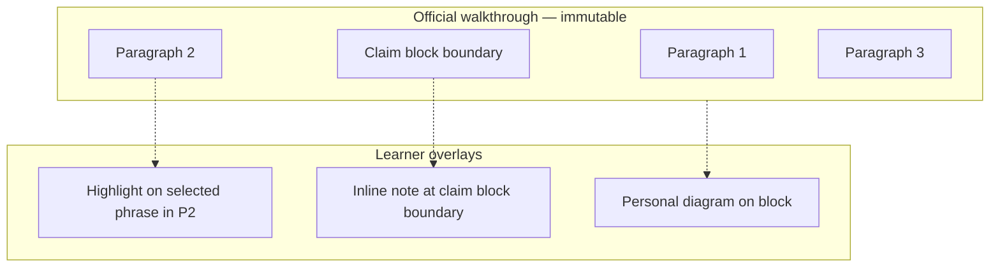
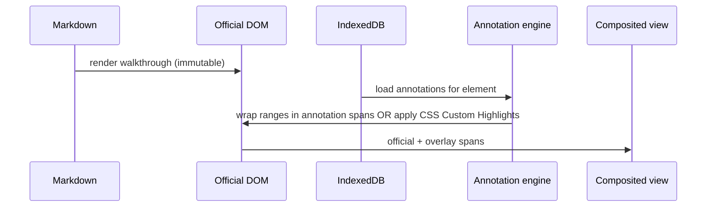

# Renderer V2 — Annotation System

> Parent: [README.md](./README.md)  
> Research evidence: [`05-research/RESEARCH_LOG.md`](../../05-research/RESEARCH_LOG.md) Session 002  
> Data model: [08-DATA_MODEL.md](./08-DATA_MODEL.md)

---

## Philosophy

Lou studies on paper. She highlights, underlines, colours, and writes in margins. The digital renderer reproduces this **without becoming an editor**.

Core principles:

1. **Annotations are overlays** — they never modify official content in storage or in the persisted artefact layer
2. **Annotations are personal** — learner-owned, never generated, never fed to AI
3. **Annotations are simple** — a focused toolset, not Google Docs
4. **Annotations are separable** — stored independently, merged at display time
5. **Annotations are removable** — every mark can be deleted individually

The renderer is **not** collaborative. There is no multi-user editing, no comments thread, no track changes.

---

## Relationship to existing learner mechanisms

[`IMPLEMENTATION_CONTRACT.md`](../../IMPLEMENTATION_CONTRACT.md) Part B defines **two separate mechanisms** that must not be unified:

| Mechanism | Behaviour | Anchor | V2 status |
|---|---|---|---|
| **Personal Diagrams** (C.8) | Photograph own drawing | Blueprint element ID | Implemented — unchanged |
| **Inline Notes** (C.9) | Text note at claim-block boundary | `(elementId, claimBlockId)` | Implemented — coexists with selection annotations |
| **Text selection annotations** (V2) | Highlight, emphasis, margin note on selected text | Text quote selector within element | New |

Text selection annotations **extend** the learner layer. They do not replace Inline Notes — claim-block notes remain valuable for structural reminders; selection annotations serve fine-grained reading marks.



---

## Supported interactions (V2)

### Text selection

- User selects text within a walkthrough container marked `data-official="true"`
- Selection outside official content (chrome, notices) does not trigger toolbar
- Floating toolbar appears near selection

### Floating toolbar actions

| Action | Behaviour |
|---|---|
| **Highlight** | Background colour on selection — ≈5 colours (yellow, green, blue, pink, orange) |
| **Bold emphasis** | Visual bold overlay — not DOM `<strong>` mutation |
| **Italic emphasis** | Visual italic overlay |
| **Strike-through** | Visual strike overlay |
| **Text colour** | Foreground colour on selection — limited palette |
| **Add note** | Selection note attached to selected text |
| **Remove** | Delete active annotation |

Toolbar dismisses on click outside or Escape.

### Selection notes (not Inline Notes)

- Short free-text note displayed in margin or collapsible callout
- Linked to the text quote selector, not to claim-block ID
- Removable independently of highlight

### Removal

- Select annotated text → toolbar shows remove
- Or: notes panel lists annotations with delete affordance
- Removing annotation deletes storage record; official content unchanged

---

## What is explicitly excluded

| Excluded | Reason |
|---|---|
| Edit official paragraph text | Immutability invariant |
| Rich-text editor (headings, lists) | Not a word processor |
| Collaborative comments | Not Google Docs |
| AI summary of highlights | Learner layer never feeds AI |
| Export to modified PDF of official content | Would blur immutability |
| Unlimited colour picker | Complexity; 5 colours sufficient |
| Threaded replies on notes | Collaboration scope |

---

## Display model — overlay, not mutation

Official markdown renders to HTML once. Annotations apply in a **second pass**:



**Preferred approach:** CSS Custom Highlight API (`::highlight()`) for background colours where browser support allows, with `<mark class="learner-highlight">` wrapper fallback for emphasis types requiring structure.

Official text nodes remain the source of truth in the DOM. Annotation spans are siblings or highlight pseudo-elements — never `contenteditable`.

---

## Anchoring strategy

Annotations must survive **minor DOM changes** (typography CSS updates) and degrade gracefully on **content regeneration**.

### Primary anchor: Text Quote Selector (W3C Web Annotation model)

Store:

```json
{
  "type": "TextQuoteSelector",
  "exact": "pression capillaire pulmonaire",
  "prefix": "augmentation de la ",
  "suffix": " au-delà d'un certain"
}
```

Scoped to:

- `chapterId`
- `projectionId`
- `elementId` (Blueprint element — narrows search space)
- Optional `claimBlockId` (secondary hint for degradation)

### Resolution on load

1. Find walkthrough container for `elementId`
2. Search container text for `exact` with `prefix`/`suffix` disambiguation
3. If found → apply annotation
4. If not found → degrade to element-level orphan list (same discipline as Inline Notes)

### Library recommendation: `dom-anchor-text-quote`

| Property | Value |
|---|---|
| License | MIT |
| Maturity | Used by Hypothesis; ~10K weekly npm downloads |
| Purpose | Bidirectional conversion between DOM Range ↔ TextQuoteSelector |
| Approximate matching | Uses `diff-match-patch` for minor text drift |

Alternative considered: **`dom-anchor-text-position`** (character offsets) — rejected as primary because offsets break on any HTML structure change. Use as secondary hint only.

### Browser-native foundations

| API | Use |
|---|---|
| `Selection` / `Range` | Capture user selection |
| CSS Custom Highlight API | Paint highlights without DOM mutation (Chrome 105+, Safari 17.2+) |
| `::selection` pseudo | Toolbar trigger styling only |

---

## Open-source landscape evaluated

| Project | License | Assessment |
|---|---|---|
| **[dom-anchor-text-quote](https://github.com/hypothesis/dom-anchor-text-quote)** | MIT | **Recommended** — text anchoring |
| **[dom-anchor-text-position](https://github.com/hypothesis/dom-anchor-text-position)** | MIT | Secondary hint only |
| **Hypothesis client** | BSD / complex | Full annotation suite — too heavy; collaborative assumptions |
| **Annotator.js** | MIT | Unmaintained (2015); avoid |
| **ProseMirror / Tiptap** | MIT | Editor frameworks — wrong model (mutation-based) |
| **Medium.js** | MIT | Inline editing — wrong model |
| **Rangy** | MIT | Range serialization — optional supplement for older browsers |
| **mark.js** | MIT | Text search highlight — no persistence/anchoring; utility only |

**Decision:** One small MIT dependency (`dom-anchor-text-quote`) for anchoring; browser-native APIs for selection and highlighting; custom lightweight toolbar. No editor framework.

---

## Toolbar UX

```
┌──────────────────────────────────────────────┐
│  🟨  🟩  🟦  🩷  🟧  │  B  I  S  A  │  📝  ✕  │
└──────────────────────────────────────────────┘
         colours          emphasis    note  remove
```

- Appears above selection; flips below if near viewport top
- Keyboard: arrow keys between actions; Enter activates
- Touch: adequate 44px targets
- Does not obscure selected text

---

## Durability expectations

| Event | Expected behaviour |
|---|---|
| CSS/theme change | Annotations restore via text quote |
| Minor typo fix in regeneration | Approximate match may succeed (`diff-match-patch`) |
| Claim block re-cut | Selection annotation degrades to orphan or element-level note |
| Element removed from Blueprint | Orphan panel entry |
| Renderer version upgrade | IndexedDB schema migration; anchor format stable |

Set learner expectations: highlights are **durable but not immortal** — same as pencil marks after a new edition of a textbook.

---

## Storage

All annotation records live in IndexedDB — see [08-DATA_MODEL.md](./08-DATA_MODEL.md). Never in Git beside medical content. Never in projection files.

---

## Testing requirements

- Round-trip: select text → save → reload → highlight restored
- Disambiguation: duplicate phrase in walkthrough → prefix/suffix resolves correctly
- Degradation: text removed → orphan surfaced
- Boundary: selection in official container only — chrome excluded
- Removal: delete annotation → storage empty → no DOM residue

---

## Implementation phasing

| Phase | Scope |
|---|---|
| **V2.1** | Highlight + remove; TextQuoteSelector anchoring |
| **V2.2** | Bold, italic, strike, text colour |
| **V2.3** | Selection-linked margin notes |
| **V2.4** | Annotation list panel; bulk management |

Personal Diagrams and claim-block Inline Notes ship unchanged throughout.
