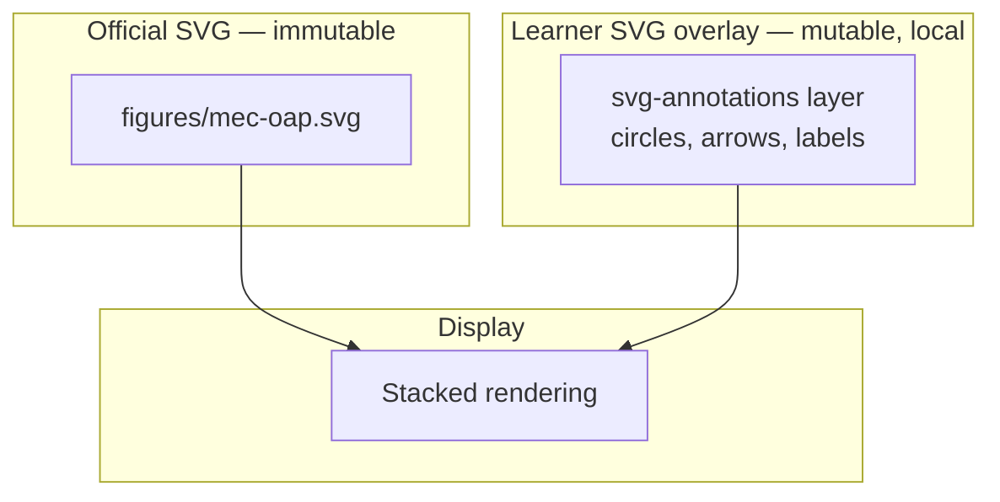
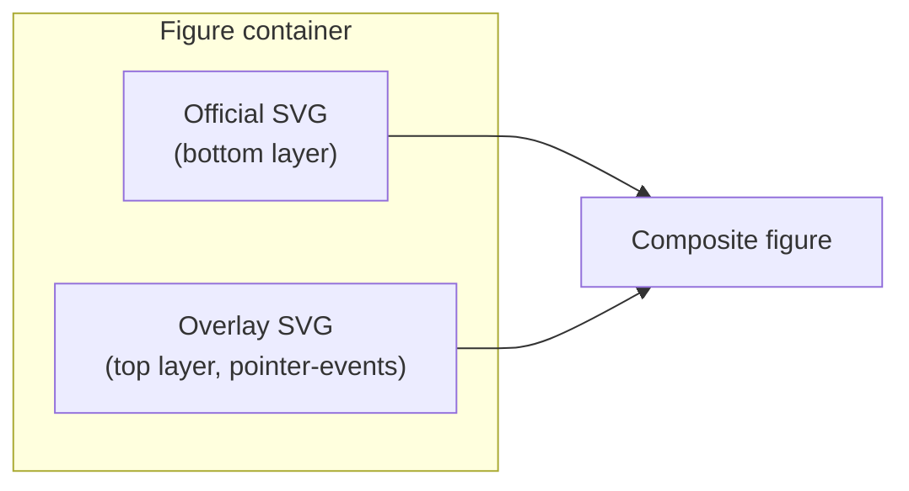

# Renderer V2 — SVG Annotations

> Parent: [README.md](./README.md)  
> SVG display: [05-SVG_EXPERIENCE.md](./05-SVG_EXPERIENCE.md)  
> Text annotations: [06-ANNOTATION_SYSTEM.md](./06-ANNOTATION_SYSTEM.md)

---

## Long-term philosophy

SVG annotations follow the same invariant as text annotations:

> **SVG annotations are overlays. Never modifications.**

Official SVGs remain immutable. The build pipeline regenerates figures from visual specifications; the learner never edits nodes, paths, or labels in the official SVG file.



This mirrors paper study: Lou traces arrows on a printed diagram with a pencil. The textbook diagram is unchanged; her marks are hers.

---

## Why SVG annotations are separate from text annotations

| Dimension | Text annotations | SVG annotations |
|---|---|---|
| Coordinate space | DOM text range | SVG viewBox coordinates |
| Anchor | TextQuoteSelector | `(elementId, svgX, svgY)` or shape definition |
| Rendering | CSS highlights / mark spans | SVG overlay layer |
| Official container | Walkthrough HTML | Figure element |
| Durability driver | Text regeneration | SVG re-render (layout may change) |

Different coordinate systems and different regeneration behaviour justify separate storage and modules — but the **boundary rules are identical**: learner-owned, never fed to AI, never modifying official assets.

---

## Scope — long-term (not V2.1)

SVG overlay annotations are **Phase 3+** in the roadmap ([13-ROADMAP.md](./13-ROADMAP.md)). Documented now so architecture does not require redesign when implemented.

### Planned interactions

| Interaction | Description |
|---|---|
| **Freehand stroke** | Pencil path over figure |
| **Arrow** | Point from A to B |
| **Circle / rectangle** | Emphasise region |
| **Text label** | Short learner label on overlay |
| **Remove** | Delete individual overlay shapes |

### Not planned

- Editing official SVG node labels
- Moving official graph nodes
- Colouring official nodes (would imply semantic change)
- OCR or AI interpretation of learner marks

---

## Overlay architecture



Implementation approach:

1. Wrap official figure in `position: relative` container
2. Official SVG: `pointer-events: none` when overlay mode active (or passthrough for zoom)
3. Overlay SVG: same `viewBox` as official; `position: absolute; inset: 0`
4. Learner shapes drawn in overlay coordinate space
5. Overlay persisted as JSON shape list in IndexedDB — not as modified SVG file

### Inline vs stacked overlay

| Mode | When |
|---|---|
| **Stacked overlay SVG** | Default — works with ``-embedded official SVG |
| **Inline official SVG + overlay** | When DOM access to official SVG viewBox is needed |

Prefer stacked overlay to avoid requiring inline official SVG for all figures.

---

## Anchoring and durability

SVG regeneration may change node positions. Learner annotations anchored to **absolute viewBox coordinates** will drift.

### Anchoring strategy (long-term)

**Primary:** normalised coordinates (`x / viewBoxWidth`, `y / viewBoxHeight`) — survives resize if viewBox stable.

**Secondary:** optional semantic anchor — nearest official node ID if click target is within `data-node` hit region. Requires inline SVG or manifest node registry (future).

**Degradation:** if viewBox dimensions change on regeneration, attempt scale transform; if mismatch exceeds threshold, surface in orphan panel.

Durability expectations are **lower** than text quote anchoring. Communicate to learner: diagram marks may need redoing after figure update — like redrawing on a new print of a diagram.

---

## Relationship to `annotated-figure` primitive

The grammar library's reserved `annotated-figure` primitive ([`VISUAL_GRAMMAR_LIBRARY.md`](../../VISUAL_GRAMMAR_LIBRARY.md) §5.10) defines **official** annotations — spec-owned labels over base artwork. These are generated, traceable, and part of the Official Visual.

**Learner SVG overlays are unrelated.** They are personal marks over any Official Visual, whether generated or manual. Naming collision is avoided by terminology:

- **Official annotations** — from visualSpec, in the generated SVG
- **Learner overlays** — from learner-store, in the overlay layer

---

## Storage

See [08-DATA_MODEL.md](./08-DATA_MODEL.md) — `svgOverlays` store keyed by `(chapterId, elementId)`.

Shape record example:

```json
{
  "id": "uuid",
  "type": "arrow",
  "from": { "nx": 0.23, "ny": 0.45 },
  "to": { "nx": 0.67, "ny": 0.52 },
  "stroke": "#e74c3c",
  "createdAt": "ISO-8601"
}
```

Normalised coordinates (`nx`, `ny`) in 0–1 range relative to viewBox.

---

## Accessibility

- Overlay shapes are decorative learner content — `aria-hidden="true"` on overlay SVG
- Official SVG `<title>` and `<desc>` remain the accessible description
- Overlay mode toggle announced to screen readers
- Keyboard-only learners: overlay mode optional; core reading experience unaffected

---

## Non-goals

- Export learner-marked SVG as official asset
- Share overlay with other users
- Sync overlay to cloud (future personal backup is optional, not collaboration)
- Snap-to-node intelligent routing (unless semantic anchors added later)
