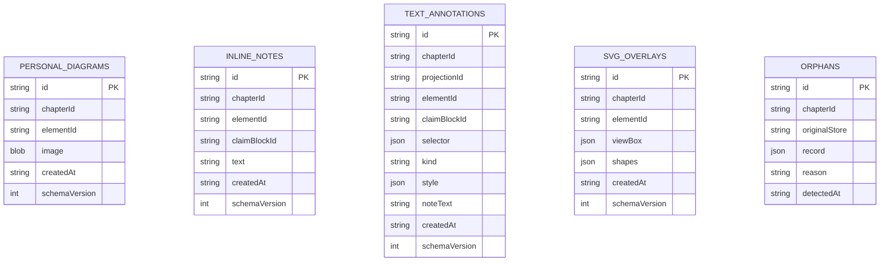

# Renderer V2 — Data Model

> Parent: [README.md](./README.md)  
> Contract: [`IMPLEMENTATION_CONTRACT.md`](../../IMPLEMENTATION_CONTRACT.md) C.8, C.9

Lightweight schemas for learner-layer data. Designed to survive renderer evolution through explicit schema versioning.

---

## Design principles

1. **Separate from official content** — never stored in chapter Git tree
2. **Minimal fields** — only what display and anchoring require
3. **Stable anchor formats** — TextQuoteSelector for text; normalised coords for SVG overlays
4. **Forward-compatible** — `schemaVersion` on database and records
5. **No medical semantics** — no KP references, no claim classes, no provenance stamps

---

## Storage backend

**IndexedDB** in the browser — already used by `learner-store.js`.

| Property | Value |
|---|---|
| Database name | `lou-learner` |
| Version | Integer; incremented on schema change |
| Scope | Per browser, per origin |
| Namespace | `chapterId` on every record |

Future optional export: JSON file download for learner backup — not sync, not Git.

---

## Object stores



---

## Personal Diagram (existing — unchanged)

```typescript
interface PersonalDiagram {
  id: string;              // uuid
  chapterId: string;       // e.g. "cardio/234"
  elementId: string;       // e.g. "MEC-oap"
  image: Blob;             // JPEG/PNG photograph
  createdAt: string;       // ISO-8601
  schemaVersion: 1;
}
```

**Index:** `[chapterId, elementId]`

---

## Inline Note (existing — unchanged)

```typescript
interface InlineNote {
  id: string;
  chapterId: string;
  elementId: string;
  claimBlockId: string;    // e.g. "cb-threshold-041"
  text: string;
  createdAt: string;
  schemaVersion: 1;
}
```

**Index:** `[chapterId, elementId]`

**Degradation:** if `claimBlockId` not found on load, display at element level with `movedAnchor` marker.

---

## Text Annotation (V2)

```typescript
interface TextAnnotation {
  id: string;
  chapterId: string;
  projectionId: string;    // manifest projection id
  elementId: string;
  claimBlockId?: string;   // optional hint for degradation

  selector: TextQuoteSelector;
  kind: "highlight" | "bold" | "italic" | "strike" | "textColor";
  style?: {
    color?: string;        // hex for highlight or textColor
  };
  noteText?: string;       // optional margin note attached to selection

  createdAt: string;
  schemaVersion: 1;
}

interface TextQuoteSelector {
  type: "TextQuoteSelector";
  exact: string;
  prefix?: string;
  suffix?: string;
}
```

**Index:** `[chapterId, elementId]`

**Uniqueness:** multiple annotations per element allowed; overlapping ranges permitted.

---

## SVG Overlay (future)

```typescript
interface SvgOverlay {
  id: string;
  chapterId: string;
  elementId: string;

  viewBox: {
    width: number;
    height: number;
  };

  shapes: OverlayShape[];
  createdAt: string;
  schemaVersion: 1;
}

interface OverlayShape {
  id: string;
  type: "stroke" | "arrow" | "circle" | "rect" | "label";
  geometry: Record<string, number>;  // normalised 0-1 coords
  stroke?: string;
  fill?: string;
  text?: string;
}
```

**Index:** `[chapterId, elementId]` — one overlay document per figure (shapes array appendable).

---

## Orphan records

When anchoring fails, move record to orphans store rather than delete:

```typescript
interface OrphanRecord {
  id: string;
  chapterId: string;
  originalStore: "inlineNotes" | "textAnnotations" | "svgOverlays";
  record: object;          // original payload
  reason: "elementRemoved" | "anchorNotFound" | "viewBoxChanged";
  detectedAt: string;
}
```

Surfaced in UI orphan panel ([`02-PRODUCT_SPECIFICATION.md`](./02-PRODUCT_SPECIFICATION.md)).

---

## Schema migration

```javascript
// Pseudocode — indexedDB onupgradeneeded
const MIGRATIONS = {
  1: db => {
    db.createObjectStore("personalDiagrams", { keyPath: "id" });
    db.createObjectStore("inlineNotes", { keyPath: "id" });
  },
  2: db => {
    db.createObjectStore("textAnnotations", { keyPath: "id" });
  },
  3: db => {
    db.createObjectStore("svgOverlays", { keyPath: "id" });
    db.createObjectStore("orphans", { keyPath: "id" });
  },
};
```

Migration rules:

- Never delete learner data silently
- On schema upgrade, copy forward compatible records
- Bump `schemaVersion` on record if field semantics change

---

## What is intentionally absent

| Absent field | Reason |
|---|---|
| `userId` | Single learner (Lou); multi-user is non-goal |
| `kpId` | Learner layer has no medical semantics |
| `provenance` | Not generated content |
| `syncToken` | No cloud sync in V2 |
| `editedAt` on official content | Official content not stored here |

---

## Renderer evolution compatibility

To survive renderer rewrites (e.g. framework migration):

| Stable | May change |
|---|---|
| TextQuoteSelector format (W3C standard) | DOM structure around official content |
| `chapterId`, `elementId` identifiers | CSS class names |
| IndexedDB store names | Module organisation |
| Record UUIDs | UI for creating annotations |

Export/import JSON with schema version header enables manual migration if IndexedDB is ever replaced (e.g. native app wrapper).
