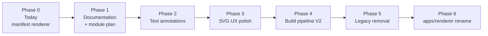

# Renderer V2 — Migration Plan

> Parent: [README.md](./README.md)  
> Cleanup: [11-REPOSITORY_CLEANUP.md](./11-REPOSITORY_CLEANUP.md)  
> Roadmap: [13-ROADMAP.md](./13-ROADMAP.md)

Incremental migration from today's repository to the target renderer. **The repository must remain functional at every step.**

---

## Migration principles

1. **Evolve, don't rewrite** — extend `demo/renderer/`, do not parallel-implement
2. **One change per phase** — each phase leaves tests green
3. **Manifest contract frozen** — renderer migration does not change build outputs
4. **Legacy paths until explicit removal** — fallbacks stay until no active chapter needs them
5. **No big-bang rename** — directory moves happen late, after code stabilises

---

## Component classification

### Browser renderer (`demo/renderer/`)

| File / concern | Classification | Action |
|---|---|---|
| `index.html` | **KEEP** | Evolve — add module scripts when ready |
| `app.js` | **KEEP** | Extend — event emission, annotation lifecycle |
| `config.js` | **KEEP → TRIM** | Remove `TABS` fallback in final cleanup phase |
| `renderer.js` | **KEEP** | Extend — source panel polish |
| `markdown.js` | **KEEP** | Unchanged |
| `blocks.js` | **KEEP → SPLIT** | Extract annotation mounting to new modules |
| `learner-store.js` | **KEEP → EXTEND** | Add `textAnnotations` store; schema v2 |
| `styles.css` | **KEEP → EXTEND** | Reading tokens, toolbar, highlight styles |
| `lib/marked.min.js` | **KEEP** | Vendored dep |
| `test/renderer.test.js` | **KEEP → EXTEND** | Annotation contract tests |
| `package.json` | **KEEP** | Add `dom-anchor-text-quote` when implemented |

### Directory rename

| Current | Target | Classification |
|---|---|---|
| `demo/renderer/` | `apps/renderer/` | **MOVE** — late migration phase only |
| `demo/legacy/` | — | **REMOVE AFTER MIGRATION** |
| `demo/README.md` | — | **REMOVE** (empty stub) |

### Legacy content fallback

| Path | Classification | Action |
|---|---|---|
| `01-learning/generated-assets/cardio/234-*` | **LEGACY** | **REMOVE AFTER MIGRATION** — when manifest always exists |
| `01-learning/generated-assets/cardio/221-*` | **LEGACY** | **REMOVE AFTER MIGRATION** |
| `config.js` `TABS` registry | **LEGACY** | **REMOVE AFTER MIGRATION** |
| `config.js` slug aliases | **KEEP** | Permanent — old URLs must resolve |

### Build pipeline (not browser renderer — included for SVG migration)

| Component | Classification | Action |
|---|---|---|
| `tools/lou-build/src/cli/build.ts` | **KEEP** | Unique CLI — `npm run validate` / `build` |
| `tools/lou-build/lib/package.js` | **KEEP** | Manifest helpers only (`assembleManifest`, `invalidatePublishableState`) |
| `tools/lou-build/lib/svg.js` (V1) | **LEGACY** | **REMOVE AFTER MIGRATION** — when V2 covers `process-flow` |
| `tools/lou-build/lib/visual-spec.js` | **KEEP** | Ratify schema; extend primitives |
| `tools/lou-build/lib/visual-ground.js` | **KEEP** | Unchanged |
| `tools/lou-build/lib/visual-layout.js` | **KEEP** | Extend per primitive |
| `tools/lou-build/lib/visual-render.js` | **KEEP** | Authoritative SVG renderer target |
| `tools/lou-build/lib/text-fit.js` | **KEEP** | Unchanged |
| `chapters/.../render-visual-specs.mjs` | **MERGE** | Logic into `package.js`; remove manual script |

### Templates and prompts

| Path | Classification | Action |
|---|---|---|
| `templates/design-system.md` | **KEEP** | Authoritative visual tokens |
| `templates/svg/diagram-template.svg` | **KEEP** | Reference for manual SVGs |
| `templates/svg/svg-style-guide.md` | **KEEP** | Subordinate to grammar contract |
| `templates/svg/svg-patterns.md` | **LEGACY DOC** | Superseded by grammar library — archive |
| `templates/svg-style-guide-draft.md` | **LEGACY DOC** | **REMOVE AFTER MIGRATION** |
| `templates/prompt/generate-svg.md` | **LEGACY** | **REMOVE AFTER MIGRATION** — ordinal model obsolete |

### Documentation

| Document | Classification | Action |
|---|---|---|
| `docs/renderer/*` | **AUTHORITATIVE** | This document set |
| `demo/renderer/README.md` | **KEEP** | Operational quick start; link to docs/renderer |
| `IMPLEMENTATION_CONTRACT.md` | **KEEP** | Upstream contract |
| `ARCHITECTURE_AUDIT.md` | **LEGACY DOC** | Historical — add deprecation banner |
| `PRODUCTION_ARCHITECTURE.md` | **LEGACY DOC** | Historical |
| `README.md` (root) | **UPDATE** | Point to current architecture |

---

## Migration phases

### Phase 0 — Current state (complete)

- [x] Manifest-driven renderer in `demo/renderer/`
- [x] Pedagogical blocks, visual binding by ID
- [x] Personal Diagrams + Inline Notes
- [x] Contract tests
- [x] Item 234 understanding v1 (4 projections)

**Verification:** `cd demo/renderer && npm test`; load `?chapter=cardio/234`

### Phase 1 — Architecture documentation (this deliverable)

- [x] Official document set in `docs/renderer/`
- [x] ADR-002
- [x] Update `demo/renderer/README.md` with link to docs
- [x] Add deprecation note to `ARCHITECTURE_AUDIT.md` header

**Verification:** New contributor can orient from `docs/renderer/README.md`

### Phase 2 — Text selection annotations

- [ ] Add `dom-anchor-text-quote` dependency
- [ ] Create `text-annotations.js`, `selection-toolbar.js`, `anchoring.js`
- [ ] Extend `learner-store.js` with `textAnnotations` store (schema v2)
- [ ] Mark official walkthrough containers `data-official="true"`
- [ ] Implement highlight + remove (V2.1)
- [ ] Add emphasis types (V2.2)
- [ ] Contract tests for round-trip anchoring

**Verification:** Select text → highlight → reload → highlight restored; official markdown files untouched

### Phase 3 — SVG display polish

- [ ] Extract `svg-display.js` from `blocks.js`
- [ ] Responsive figure styling
- [ ] Click-to-zoom modal
- [ ] `prefers-reduced-motion` on modal

**Verification:** `mec-oap.svg` readable on mobile viewport; zoom accessible via keyboard

### Phase 4 — Build pipeline integration (parallel track)

- [ ] Wire `visual-render.js` into `lou-build build`
- [ ] Publish V2-generated SVGs in manifest (e.g. `MM-pump-decompensation`)
- [ ] Extend V2 renderers for additional primitives incrementally
- [ ] Deprecate `svg.js` when `process-flow` covered by V2

**Verification:** `lou-build build` produces all manifest-declared visuals; no manual `render-visual-specs.mjs`

### Phase 5 — Legacy removal

- [ ] Confirm all active chapters have manifests (not just Item 234)
- [ ] Remove `generated-assets/` fallback path from `config.js`
- [ ] Remove `TABS` registry
- [ ] Delete `demo/legacy/`
- [ ] Delete obsolete prompts and legacy SVG corpus
- [ ] Add deprecation headers to superseded docs

**Verification:** Renderer errors clearly on unbuilt chapter; no silent fallback to ordinal SVGs

### Phase 6 — Repository reorganisation

- [ ] Move `demo/renderer/` → `apps/renderer/`
- [ ] Update all path references in README, docs, CI
- [ ] Remove empty `demo/` directory
- [ ] Update root `README.md`

**Verification:** Same URL pattern works with updated paths; all tests pass

---

## Risk register

| Risk | Mitigation |
|---|---|
| Annotation anchoring breaks on regeneration | TextQuoteSelector + orphan panel; set learner expectations |
| Removing fallback breaks dev workflows | Phase 5 only after all dev chapters built |
| V2 SVG pipeline delays | Phase 3 SVG UX works with V1 output; pipeline independent |
| Framework temptation | ADR-002 locks vanilla-first; revisit only with evidence |
| Documentation drift | `docs/renderer/` is SoT; operational README links here |

---

## Rollback strategy

Each phase is independently revertible via Git:

- Phase 2: Remove annotation modules; learner-store schema v1 still works
- Phase 3: CSS/modal changes isolated to svg-display
- Phase 4: Keep `svg.js` until V2 proven — do not delete V1 until Phase 4 complete
- Phase 5: Fallback removal is the highest-risk step — require explicit checklist

---

## Definition of done

Migration is complete when:

1. `apps/renderer/` is the sole browser renderer implementation
2. No legacy fallback to `generated-assets/`
3. Text selection annotations shipped (V2.1 minimum)
4. V2 SVG pipeline integrated in build for all published visuals
5. `svg.js` V1 removed
6. Obsolete renderer code and docs removed or marked historical
7. New contributor orientation requires only `docs/renderer/README.md`
