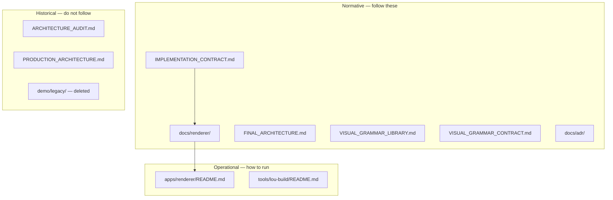

# Renderer V2 — Repository Cleanup Strategy

> Parent: [README.md](./README.md)  
> Migration: [10-MIGRATION_PLAN.md](./10-MIGRATION_PLAN.md)

Final repository organisation after migration completes. **Do not execute cleanup before Phase 5 of the migration plan.**

---

## Target directory structure

```
lou-medecine/
├── apps/
│   └── renderer/                    # Browser educational app (from demo/renderer/)
│       ├── index.html
│       ├── src/                     # ES modules (optional grouping)
│       │   ├── app.js
│       │   ├── config.js
│       │   ├── renderer.js
│       │   ├── markdown.js
│       │   ├── blocks.js
│       │   ├── svg-display.js
│       │   ├── learner-store.js
│       │   ├── text-annotations.js
│       │   ├── selection-toolbar.js
│       │   ├── anchoring.js
│       │   └── svg-annotations.js   # future
│       ├── styles.css
│       ├── lib/
│       │   └── marked.min.js
│       ├── test/
│       └── README.md                # Operational quick start
│
├── tools/
│   └── lou-build/                   # Chapter build + SVG generation
│       └── lib/
│           ├── package.js
│           ├── visual-spec.js       # Authoritative SVG pipeline
│           ├── visual-ground.js
│           ├── visual-layout.js
│           ├── visual-render.js
│           └── ...                  # (svg.js removed)
│
├── 01-learning/
│   ├── chapters/                    # Built chapters — renderer input
│   │   └── {specialty}/{item}/
│   │       ├── manifest.json
│   │       ├── projections/
│   │       ├── figures/
│   │       └── build/
│   ├── full-edn/                    # Official source (immutable)
│   └── templates/
│       ├── design-system.md
│       └── svg/
│
├── docs/
│   ├── renderer/                    # AUTHORITATIVE renderer docs (this set)
│   └── adr/
│       ├── ADR-001-freeze-svg-grammar-catalogue.md
│       └── ADR-002-renderer-v2-architecture.md
│
├── 05-research/                     # Evidence — not normative
│
├── FINAL_ARCHITECTURE.md            # System architecture
├── IMPLEMENTATION_CONTRACT.md       # Component contracts
├── VISUAL_GRAMMAR_LIBRARY.md        # SVG grammar catalogue
└── VISUAL_GRAMMAR_CONTRACT.md       # SVG grammar governance
```

---

## Directories that disappear

| Path | Reason |
|---|---|
| `demo/` | Renamed to `apps/`; legacy subdirs removed |
| `demo/legacy/` | Visual design absorbed into design system |
| `demo/renderer/` | Moved to `apps/renderer/` |
| `03-architecture/` | Empty stub — renderer docs in `docs/renderer/` |

---

## Directories that shrink

| Path | What goes |
|---|---|
| `01-learning/generated-assets/` | Entire cardio/234 and cardio/221 prototype corpora after chapters built |
| `01-learning/templates/` | `prompt/generate-svg.md`, `svg-style-guide-draft.md`, superseded `svg-patterns.md` |

---

## Directories unchanged

| Path | Role |
|---|---|
| `01-learning/chapters/` | Built chapter packages — renderer consumes these |
| `01-learning/full-edn/` | Official college source |
| `tools/lou-build/` | Build pipeline (minus V1 svg.js) |
| `05-research/` | Research evidence |
| `00-foundation/` | Product vision |

---

## Authoritative documentation map



---

## Files becoming obsolete

| File | Disposition |
|---|---|
| `ARCHITECTURE_AUDIT.md` | Add header: "Historical baseline pre-manifest renderer" |
| `PRODUCTION_ARCHITECTURE.md` | Add header: "Superseded by FINAL_ARCHITECTURE.md" |
| `CURRENT_PRIORITIES.md` | Update or archive — contradicts active development |
| `README.md` | Rewrite onboarding to point to docs/renderer, lou-build, chapters |
| `START_HERE.md` | Update to include renderer in onboarding path |
| `demo/README.md` | Delete with demo/ |
| `03-architecture/README.md` | Delete or redirect to docs/renderer |
| `01-learning/templates/prompt/generate-svg.md` | Delete — ordinal generation model |
| `01-learning/templates/svg-style-guide-draft.md` | Delete — merged into design-system |
| `tools/lou-build/lib/svg.js` | Delete after V2 covers process-flow |

---

## Code that must not return

Patterns permanently rejected:

```javascript
// REJECTED — medical content in renderer
const TABS = {
  mecanismes: `<h2>OAP</h2><p>Le seuil est > 25 mmHg...</p>`
};

// REJECTED — ordinal visual binding
const svgPath = `figures/mechanism-${index}.svg`;

// REJECTED — renderer-authored alt text
img.alt = "Diagram showing pulmonary congestion leading to OAP";
```

Enforce via contract tests and code review against [04-TARGET_ARCHITECTURE.md](./04-TARGET_ARCHITECTURE.md).

---

## Cleanup execution checklist

Execute only when [10-MIGRATION_PLAN.md](./10-MIGRATION_PLAN.md) Phase 5 prerequisites met:

- [ ] All active development chapters have `manifest.json`
- [ ] No contributor relies on `generated-assets/` fallback
- [ ] V2 SVG pipeline publishes all declared visuals
- [ ] Contract tests pass without fallback fixtures
- [ ] `docs/renderer/` reviewed and current
- [ ] Git history preserves deleted files (no force-push needed)

---

## Post-cleanup contributor experience

A new contributor clones the repo and:

1. Reads `docs/renderer/README.md` — understands renderer role and location
2. Runs `python3 -m http.server 8765` from root
3. Opens `apps/renderer/index.html?chapter=cardio/234`
4. Runs `cd apps/renderer && npm test`
5. Finds no `demo/`, no `generated-assets/` fallback, no duplicate renderer implementations

The repository presents **one browser app**, **one build tool**, **one documentation entry point**.
