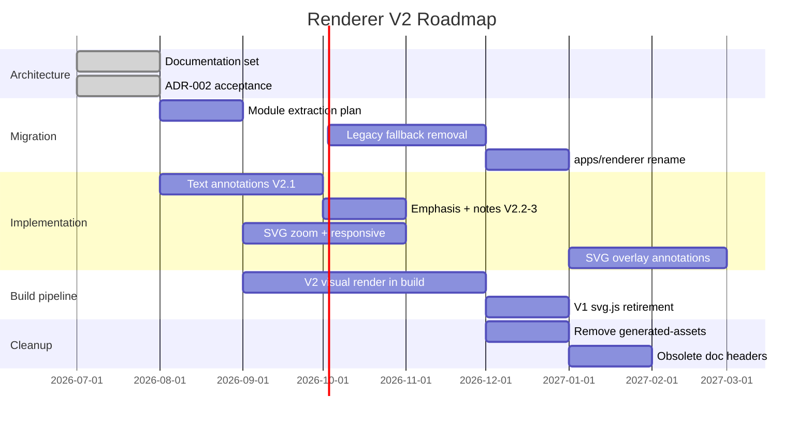

# Renderer V2 — Roadmap

> Parent: [README.md](./README.md)  
> Migration: [10-MIGRATION_PLAN.md](./10-MIGRATION_PLAN.md)

Realistic implementation roadmap in small incremental steps. Timelines are indicative — phases complete when verification criteria pass, not by calendar.

---

## Roadmap overview

---

## Track A — Architecture (complete)

| Step | Deliverable | Status |
|---|---|---|
| A.1 | Repository audit | Done — [README.md](./README.md) Phase 1 |
| A.2 | Documentation strategy | Done — `docs/renderer/` |
| A.3 | Official document set | Done — this folder |
| A.4 | ADR-002 | Done — [ADR-002](../adr/ADR-002-renderer-v2-architecture.md) |

**Exit criteria:** New contributor orients from `docs/renderer/README.md` without asking which renderer is authoritative.

---

## Track B — Implementation

### B.1 Text annotations — highlight (V2.1)

**Scope:** Minimum viable annotation layer.

| Task | Detail |
|---|---|
| Add `dom-anchor-text-quote` | Single MIT dependency |
| `data-official="true"` on walkthrough containers | Scope selection boundary |
| `text-annotations.js` | Load, apply, save highlights |
| `selection-toolbar.js` | Floating toolbar with 5 colours + remove |
| Extend IndexedDB schema v2 | `textAnnotations` store |
| Tests | Round-trip anchoring, orphan case |

**Exit criteria:** Lou can highlight a sentence in `MEC-oap` walkthrough, reload, see highlight restored.

**Estimated effort:** Small — 1–2 focused sessions.

### B.2 Text annotations — emphasis (V2.2)

**Scope:** Bold, italic, strike, text colour overlays.

| Task | Detail |
|---|---|
| CSS overlay spans for emphasis types | Fallback where Custom Highlights insufficient |
| Toolbar buttons | B, I, S, colour picker (limited palette) |
| Extend data model `kind` field | Already specified in [08-DATA_MODEL.md](./08-DATA_MODEL.md) |

**Exit criteria:** Multiple annotation types coexist on same paragraph; each removable independently.

### B.3 Text annotations — selection notes (V2.3)

**Scope:** Margin note attached to text selection.

| Task | Detail |
|---|---|
| `noteText` field on TextAnnotation | Per data model |
| Margin callout UI | Visually distinct from claim-block Inline Notes |
| Annotation list panel | Optional — view all marks in projection |

**Exit criteria:** Note on selected phrase persists across reload.

### B.4 SVG display polish (V2.3 parallel)

**Scope:** Better figure reading experience.

| Task | Detail |
|---|---|
| Extract `svg-display.js` | From blocks.js |
| Responsive figure CSS | max-width, touch targets |
| Zoom modal | Click/pinch; focus trap; reduced motion |

**Exit criteria:** `mec-oap.svg` usable on phone; keyboard-accessible zoom.

### B.5 SVG overlay annotations (future)

**Scope:** [07-SVG_ANNOTATIONS.md](./07-SVG_ANNOTATIONS.md)

| Task | Detail |
|---|---|
| Stacked overlay SVG | Same viewBox as official |
| Shape tools | Stroke, arrow, circle, label |
| `svgOverlays` IndexedDB store | Normalised coordinates |

**Exit criteria:** Learner draws arrow on figure; official SVG file unchanged.

**Defer until:** B.1–B.4 stable; Lou requests diagram marking in user testing.

---

## Track C — Migration

### C.1 Module organisation

| Task | Detail |
|---|---|
| Document module boundaries | [04-TARGET_ARCHITECTURE.md](./04-TARGET_ARCHITECTURE.md) |
| Optional ES module `type="module"` | Incremental; no bundler required initially |
| Keep tests green throughout | No behavioural change |

### C.2 Legacy fallback removal

**Prerequisite:** All dev/test chapters built with manifest.

| Task | Detail |
|---|---|
| Remove `useLegacyContentRoot()` path | config.js |
| Remove `TABS` registry | config.js |
| Delete `generated-assets/cardio/234-*` | After confirmation |
| Delete `demo/legacy/` | Design tokens preserved in templates |

### C.3 Rename to `apps/renderer/`

**Prerequisite:** C.2 complete or fallback clearly unused.

| Task | Detail |
|---|---|
| Move directory | demo/renderer → apps/renderer |
| Update docs and serve instructions | All references |
| Remove empty demo/ | Cleanup |

---

## Track D — Build pipeline (parallel)

Not browser renderer code — but blocks renderer visual completeness.

### D.1 Integrate V2 visual render

| Task | Detail |
|---|---|
| Call `renderVisualSpec()` from `package.js` | Replace manual script |
| Publish `mm-pump-decompensation.svg` in manifest | Fix planned-not-built state |
| Grounding gate in build | Fail visual eligibility explicitly |

### D.2 Extend primitives

Priority order (based on Item 234 blueprint demand):

1. `causal-graph` — in progress
2. `process-flow` — replace V1 svg.js
3. `transmission-path`
4. `comparison-matrix` (HTML primitive — renderer displays as figure or embedded HTML)
5. Remaining primitives per chapter demand

### D.3 Retire V1 svg.js

**Prerequisite:** D.2 covers process-flow.

| Task | Detail |
|---|---|
| Remove `svg.js` | lou-build |
| Remove `renderMecOapSvg` alias | Already deprecated |
| Update lou-build README | |

---

## Track E — Cleanup

| Step | When | Action |
|---|---|---|
| E.1 | After C.2 | Delete legacy SVG corpus |
| E.2 | After C.3 | Delete demo/, empty stubs |
| E.3 | After D.3 | Delete svg.js |
| E.4 | Ongoing | Deprecation headers on obsolete docs |
| E.5 | After all above | Update root README.md |

---

## Prioritisation matrix

| Priority | Work | Rationale |
|---|---|---|
| **P0** | Documentation + ADR | Prevents architectural drift — this mission |
| **P1** | Text highlight annotations | Highest learner value; validates overlay model |
| **P1** | V2 visual render in build | Unblocks second official visual on Item 234 |
| **P2** | SVG zoom/responsive | Reading UX on mobile |
| **P2** | Emphasis annotations | Complete paper-study parity |
| **P3** | Legacy removal | Reduces confusion after P1 items ship |
| **P3** | apps/renderer rename | Cosmetic/architectural clarity |
| **P4** | SVG overlay annotations | Long-term; lower urgency than text |

---

## What this roadmap deliberately excludes

- Framework adoption
- QCM / mastery UI (separate projection work in build pipeline)
- Production deploy pipeline (static host — operational, not architectural)
- Multi-chapter navigation / library view (product scope beyond renderer core)
- Dark mode (nice-to-have; not blocking)

See [12-NON_GOALS.md](./12-NON_GOALS.md).

---

## Success milestones

| Milestone | Meaning |
|---|---|
| **M1 — Spec complete** | This document set accepted |
| **M2 — Annotated reading** | Lou highlights real chapter content daily |
| **M3 — Two official visuals** | Item 234 has ≥2 published generated SVGs via V2 pipeline |
| **M4 — Legacy-free** | No fallback path; one renderer directory |
| **M5 — Scale-ready** | Second chapter loads without renderer code changes |

M1 is complete with this deliverable. M2 is the next implementation target.
