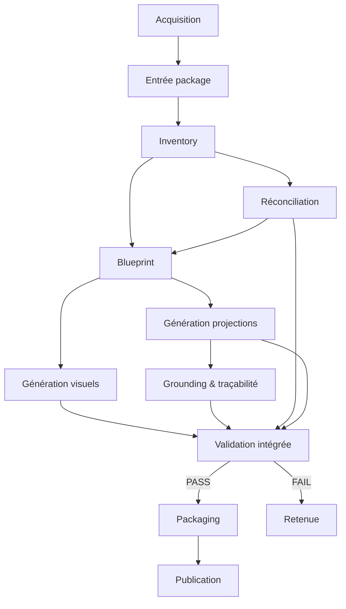
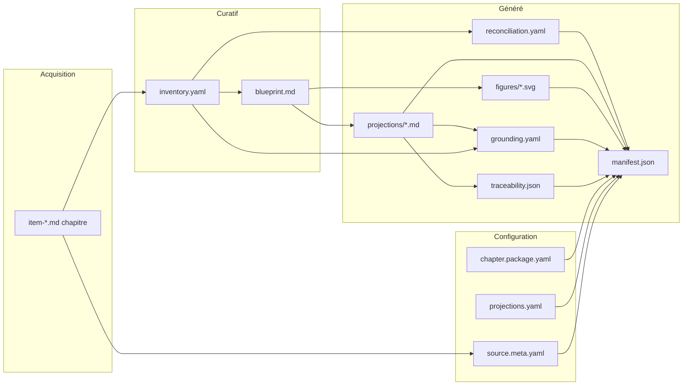
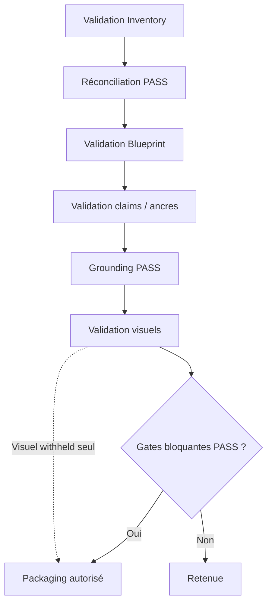

# Lou Médecine — Pipeline de la Fabrique

| | |
|---|---|
| **Type** | Document d'ingénierie de référence |
| **Version** | 1.0 |
| **Statut** | **Blueprint opérationnel — en vigueur** |
| **Phase** | **La Fabrique** |
| **Dernière mise à jour** | 2026-07-28 |
| **Parent** | [README.md](./README.md) |
| **S'appuie sur** | [`17-PUBLICATION-MODEL.md`](./17-PUBLICATION-MODEL.md) · [`18-BUILD-ARCHITECTURE.md`](./18-BUILD-ARCHITECTURE.md) |
| **Gouverné par** | Contrats fondamentaux 01–06 ([`docs/contracts/`](../contracts/00-INDEX.md)) |

Ce document est le **blueprint opérationnel** du pipeline de fabrication Lou Médecine.

Il répond à une seule question :

> **Comment la Fabrique transforme-t-elle concrètement un Collège officiel en Chapter Package publié ?**

**Périmètre :**

| Ce document (19) | Documents complémentaires |
|---|---|
| Étapes, artefacts, validations, dépendances du pipeline | Doc 18 — responsabilités conceptuelles |
| Graphes de dépendances, reprises, tableau récapitulatif | Doc 17 — état et garanties de publication |
| Frontière aval | Doc 16 — consommation Reader |

**Ce document est :** le blueprint logique du pipeline — étapes réelles, artefacts réels, validations réelles.

**Ce document n'est pas :** un guide d'implémentation, un choix technologique, une documentation CI/CD, une documentation LLM, ni une description de scripts.

En cas de conflit sur une **obligation normative**, les contrats fondamentaux priment sur ce document.

**Place dans la documentation.** Ce document **implémente logiquement** l'architecture du [doc 18](./18-BUILD-ARCHITECTURE.md) et converge vers l'état défini par le [doc 17](./17-PUBLICATION-MODEL.md). Il autorise les **artefacts réels** et le **pipeline réel** — sans parler d'implémentation technique, de scripts, d'API, de choix LLM ni de technologies.

---

## Documents connexes

| Document | Rôle |
|---|---|
| [`18-BUILD-ARCHITECTURE.md`](./18-BUILD-ARCHITECTURE.md) | Architecture conceptuelle de La Fabrique |
| [`17-PUBLICATION-MODEL.md`](./17-PUBLICATION-MODEL.md) | Modèle de publication |
| [`04-CHAPTER-PACKAGE.md`](../contracts/04-CHAPTER-PACKAGE.md) | Cycle de vie et pipeline interne (contrat) |
| [`03-ACQUISITION-SSOT.md`](../contracts/03-ACQUISITION-SSOT.md) | Chaîne acquisition amont |
| [`01-TRUST-AND-FIDELITY.md`](../contracts/01-TRUST-AND-FIDELITY.md) | Gates fidélité et grounding |

---

# 1. Vue d'ensemble

## 1.1 Pipeline complet

Le pipeline se compose de **deux zones** : l'**acquisition** (amont, hors package chapitre) et la **fabrication chapitre** (Fabrique proprement dite).

```
┌─────────────────────────────────────────────────────────────────┐
│  ACQUISITION (contrat 03 — gelée, déterministe, sans LLM)       │
│                                                                 │
│  Source primaire (PDF éditeur)                                  │
│        ↓                                                        │
│  Convertir → Markdown source officiel de l'édition              │
│        ↓                                                        │
│  Découper → Chapitres officiels (tranches verbatim par item)    │
│        ↓                                                        │
│  Qualifier → Manifestes d'édition et de découpe                  │
└─────────────────────────────────────────────────────────────────┘
        ↓
┌─────────────────────────────────────────────────────────────────┐
│  FABRIQUE CHAPITRE (contrat 04 — pipeline métier interne)       │
│                                                                 │
│  Normaliser l'entrée package                                    │
│        ↓                                                        │
│  Knowledge Inventory          [curatif]                         │
│        ↓                                                        │
│  Réconciliation de couverture [généré]                          │
│        ↓                                                        │
│  Chapter Blueprint            [curatif]                           │
│        ↓                                                        │
│  ┌──────────────────┬──────────────────┐                      │
│  │ Génération       │ Génération       │  (parallélisable       │
│  │ projections      │ visuels officiels│   après Blueprint)     │
│  └────────┬─────────┴────────┬─────────┘                      │
│           └────────┬─────────┘                                  │
│                    ↓                                            │
│  Grounding + index de traçabilité  [généré]                     │
│        ↓                                                        │
│  Validation intégrée du package                                 │
│        ↓                                                        │
│  Packaging → manifest + sidecars                                │
│        ↓                                                        │
│  Publication (état publié ou retenue)                           │
└─────────────────────────────────────────────────────────────────┘
        ↓
  Chapter Package publié
```

## 1.2 Correspondance avec l'architecture conceptuelle (doc 18)

| Responsabilité (doc 18) | Étapes pipeline (doc 19) |
|---|---|
| Acquisition | Acquisition (PDF → chapitres officiels) |
| Normalisation | Entrée package (`source.meta.yaml`) |
| Structuration | Inventory + Réconciliation + Blueprint |
| Dérivation | Génération projections + Génération visuels |
| Validation | Grounding, traçabilité, validation intégrée |
| Publication | Packaging + Publication |

## 1.3 Frontières officielles

| Frontière | Élément |
|---|---|
| **Entrée officielle du pipeline global** | Source primaire archivée (PDF éditeur) |
| **Entrée officielle de la Fabrique chapitre** | Chapitre officiel FIL B + métadonnées de source qualifiées |
| **Sortie officielle** | Chapter Package **publié** (index de publication + artefacts déclarés) |
| **Frontière curatif / généré** | Seuls **Inventory** et **Blueprint** sont curatifs canoniques ; tout le reste est généré ou configuration |
| **Frontière de publication** | État atteint lorsque toutes les gates applicables passent et le manifest est émis |

---

# 2. Étapes du pipeline

Format uniforme pour chaque étape : **mission · responsabilité · entrées · sorties · validations · dépendances · erreurs · étape suivante**.

---

## Étape A — Acquisition

| | |
|---|---|
| **Mission** | Produire la représentation textuelle officielle immuable du Collège et la découper en chapitres verbatim |
| **Responsabilité** | Acquisition (contrat 03) — **hors Fabrique chapitre**, amont qualifié et gelé |
| **Entrées** | Source primaire archivée (PDF éditeur), identifiant d'édition |
| **Sorties** | Markdown source officiel de l'édition · chapitres officiels (`item-*.md`) · manifeste d'édition · manifeste de découpe chapitres |
| **Validations** | Intégrité byte-identique · round-trip exact chapitres → markdown source · empreintes et provenance consignées |
| **Dépendances** | Aucune amont Lou ; aval : Fabrique chapitre consomme exclusivement ces sorties |
| **Erreurs possibles** | Échec conversion · découpe non déterministe · manifeste incohérent → **qualification acquisition non obtenue** ; Fabrique chapitre ne démarre pas |
| **Étape suivante** | B — Entrée package |

**Artefacts :**

| Artefact | Action |
|---|---|
| PDF archivé | Lu |
| `official-college.md` (édition) | Créé |
| `chapters/item-*.md` | Créé |
| Manifestes acquisition | Créé |

---

## Étape B — Entrée package (normalisation)

| | |
|---|---|
| **Mission** | Lier un chapitre officiel qualifié au package métier et déclarer la configuration de build |
| **Responsabilité** | Normalisation — entrée Fabrique chapitre |
| **Entrées** | Chapitre officiel FIL B · édition qualifiée |
| **Sorties** | `source.meta.yaml` (édition, lien chapitre, empreinte, index structurel de sections) · `chapter.package.yaml` (mode, scope réconciliation, absences connues, allowlists bootstrap) · `projections.yaml` (registre des projections publiées ou planifiées) |
| **Validations** | `source.meta.yaml` résout vers un chapitre existant · empreinte cohérente · index de sections exploitable pour ancres · configuration package syntaxiquement valide |
| **Dépendances** | Forte ← Étape A |
| **Erreurs possibles** | Chapitre introuvable · empreinte divergente · index sections incohérent → blocage avant structuration |
| **Étape suivante** | C — Knowledge Inventory |

**Artefacts :**

| Artefact | Couche | Action |
|---|---|---|
| Chapitre officiel FIL B | Acquisition | Lu |
| `source.meta.yaml` | Entrée package | Créé / maintenu |
| `chapter.package.yaml` | Configuration | Créé / maintenu |
| `projections.yaml` | Configuration | Créé / maintenu |

---

## Étape C — Knowledge Inventory

| | |
|---|---|
| **Mission** | Capturer exhaustivement les faits examinables du chapitre — sans pédagogie |
| **Responsabilité** | Structuration — **curatif canonique** (contrat 04 §4) |
| **Entrées** | Chapitre officiel · `source.meta.yaml` · méthodologie d'extraction |
| **Sorties** | `inventory.yaml` — points de connaissance (identité, description, ancres, disposition, historique d'édition) |
| **Validations** | Identité stable par KP · ancres résolvables · disposition obligatoire par KP · exhaustivité déclarée (scope chapitre ou slice) |
| **Dépendances** | Forte ← B |
| **Erreurs possibles** | KP sans disposition · ancres non résolvables · identités dupliquées → **retenue** ; correction curative puis reprise |
| **Étape suivante** | D — Réconciliation |

**Artefacts :**

| Artefact | Couche | Action |
|---|---|---|
| `inventory.yaml` | **Curatif** | Créé / modifié (curation) |
| Chapitre officiel | Acquisition | Lu |
| `source.meta.yaml` | Entrée | Lu |

---

## Étape D — Réconciliation de couverture

| | |
|---|---|
| **Mission** | Prouver indépendamment que la source et l'inventaire se correspondent section par section |
| **Responsabilité** | Validation de couverture — artefact **généré persisté** (contrat 01 §5, contrat 04 §4.4) |
| **Entrées** | Chapitre officiel · `inventory.yaml` · périmètre déclaré (`chapter.package.yaml`) |
| **Sorties** | `build/reconciliation.yaml` — segments source, dispositions (`represented`, `intentionally-deferred`, `excluded-with-justification`, `missed`, `ambiguously-mapped`) |
| **Validations** | Aucun segment pertinent `missed` · aucun `ambiguously-mapped` non résolu · périmètre déclaré respecté · cohérence dispositions KP ↔ segments |
| **Dépendances** | Forte ← C ; faible ← B (scope) |
| **Erreurs possibles** | Segment `missed` · ambiguïté non résolue · scope incohérent → **gate bloquante** — publication interdite |
| **Étape suivante** | E — Chapter Blueprint |

**Artefacts :**

| Artefact | Couche | Action |
|---|---|---|
| `build/reconciliation.yaml` | Généré | Créé / régénéré |
| `inventory.yaml` | Curatif | Lu |
| Chapitre officiel | Acquisition | Lu |

---

## Étape E — Chapter Blueprint

| | |
|---|---|
| **Mission** | Produire le plan pédagogique structurant — sélection, séquence, éléments pédagogiques, intentions visuelles |
| **Responsabilité** | Structuration — **curatif canonique** (contrat 04 §5) |
| **Entrées** | `inventory.yaml` · décisions curatives · périmètre pédagogique |
| **Sorties** | `blueprint.md` — modèle mental, séquence, mécanismes, raisonnement clinique, analogies, points de confusion, `visual_plan` |
| **Validations** | Chaque élément pédagogique référence ≥ 1 KP valide · sanité de sélection (KP omis = `deferred-to-mastery` ou `excluded-with-justification`) · identités d'éléments stables · cohérence séquence |
| **Dépendances** | Forte ← C · faible ← D (couverture établie) |
| **Erreurs possibles** | Référence KP invalide · KP silencieusement absent du Blueprint · élément sans question → **retenue** |
| **Étape suivante** | F et G (parallélisables) |

**Artefacts :**

| Artefact | Couche | Action |
|---|---|---|
| `blueprint.md` | **Curatif** | Créé / modifié (curation) |
| `inventory.yaml` | Curatif | Lu |

---

## Étape F — Génération des projections

| | |
|---|---|
| **Mission** | Produire les vues groundées de compréhension dérivées exclusivement du Blueprint |
| **Responsabilité** | Dérivation — contenu généré (contrat 04 §7) |
| **Entrées** | `blueprint.md` · `inventory.yaml` (traçabilité) · registre `projections.yaml` · méthodologie de génération |
| **Sorties** | Fichiers de projection (`projections/understanding/*.md`) — blocs pédagogiques (question, walkthrough, claim-traces) · tampons de provenance en frontmatter |
| **Validations** | Génération **uniquement depuis Blueprint** — jamais depuis source brute ni prose sœur · claim-traces présents · éléments projetés ⊆ Blueprint · registre cohérent |
| **Dépendances** | Forte ← E · lecture ← C · lecture ← B (`projections.yaml`) |
| **Erreurs possibles** | Élément non référencé · claim sans trace · projection hors registre → **retenue** avant grounding |
| **Étape suivante** | H — Grounding & traçabilité |

**Artefacts :**

| Artefact | Couche | Action |
|---|---|---|
| Projections `.md` | Généré | Créé / régénéré |
| `projections.yaml` | Configuration | Lu (registre) |
| `blueprint.md` | Curatif | Lu |

**Interdit :** générer une projection directement depuis la source ou depuis une projection sœur.

---

## Étape G — Génération des visuels officiels

| | |
|---|---|
| **Mission** | Produire les figures officielles à partir des intentions visuelles du Blueprint |
| **Responsabilité** | Dérivation visuelle — contenu généré (contrat 05) |
| **Entrées** | `blueprint.md` (`visual_plan`, `visual_intent`) · `inventory.yaml` (ancres, seuils) · grammaire visuelle |
| **Sorties** | **visualSpec** (sémantique) · figures SVG (`figures/*.svg`) · sidecars de grounding visuel le cas échéant |
| **Validations** | visualSpec conforme à la grammaire · structure figure valide · subordination au walkthrough vérifiable · états déclarés (`published` / `planned-not-built` / `withheld`) |
| **Dépendances** | Forte ← E · lecture ← C · **parallélisable avec F** |
| **Erreurs possibles** | Intent non supporté · échec rendu · échec grounding visuel → **withheld** (non bloquant pour walkthrough) · `required_visual_elements` non satisfait → retenue si déclaré obligatoire |
| **Étape suivante** | I — Packaging |

**Artefacts :**

| Artefact | Couche | Action |
|---|---|---|
| visualSpec (dérivé Blueprint) | Généré (intermédiaire) | Créé |
| `figures/*.svg` | Généré | Créé / supprimé si withheld |
| `build/visual-grounding*.yaml` | Généré | Créé (si applicable) |
| `blueprint.md` | Curatif | Lu |

**Régime visuel :** seul le visuel officiel bénéficie du régime d'option — échec visuel **ne bloque pas** un walkthrough par ailleurs valide (contrat 04 §11).

---

## Étape H — Grounding et traçabilité

| | |
|---|---|
| **Mission** | Vérifier la fidélité des claims et assembler le graphe de traçabilité stocké |
| **Responsabilité** | Validation — **ne produit pas de contenu médical** (contrat 01 §7) |
| **Entrées** | Projections générées · `inventory.yaml` · chapitre officiel · allowlist bootstrap (`chapter.package.yaml`) |
| **Sorties** | `build/grounding.yaml` (verdicts par claim) · `build/traceability.json` (graphe claim → KP → anchor) |
| **Validations** | Claims `sourced` étayés · claims `bridging` entraînés ou reclassifiés · seuils numériques cohérents · traçabilité complète · échec grounding walkthrough → **gate bloquante** |
| **Dépendances** | Forte ← F · lecture ← C, B, chapitre officiel |
| **Erreurs possibles** | Claim non groundé · bridging non allowlisté · incohérence seuil → **retenue** |
| **Étape suivante** | I — Packaging |

**Artefacts :**

| Artefact | Couche | Action |
|---|---|---|
| `build/grounding.yaml` | Généré | Créé / régénéré |
| `build/traceability.json` | Généré | Créé / régénéré |
| Projections | Généré | Lu |
| `inventory.yaml` | Curatif | Lu |

**Interdit :** le générateur de projections ne certifie pas sa propre sortie — le grounding est une passe **distincte**.

---

## Étape I — Validation intégrée du package

| | |
|---|---|
| **Mission** | Vérifier l'ensemble des gates applicables avant assemblage final |
| **Responsabilité** | Validation transversale |
| **Entrées** | Tous artefacts amont · résultats D, H · configuration package |
| **Validations explicites** | |

| Gate | Bloquant ? | Source |
|---|---|---|
| Configuration package valide | Oui | B |
| Inventory structurellement valide | Oui | C |
| Réconciliation PASS | Oui | D |
| Blueprint valide (refs KP, sélection) | Oui | E |
| Claims et traces complets | Oui | F |
| Ancres résolvables dans source | Oui | C + source |
| Grounding PASS | Oui | H |
| Registre projections résout | Oui | B + F |
| Subordination visuelle (si visuel publié) | Oui | G + F |
| Cohérence globale post-édition | Oui (si applicable) | Futur — contrat 04 §15.3 |

| | |
|---|---|
| **Sorties** | Verdict global PASS / FAIL · liste d'erreurs localisées |
| **Dépendances** | Forte ← D, E, F, G, H |
| **Erreurs possibles** | Toute gate bloquante en échec → **retenue** ; invalidation manifest précédent |
| **Étape suivante** | J — Packaging (si PASS) ou **retenue** |

**Peut être publié malgré :**

| Situation | Condition |
|---|---|
| Visuel `planned-not-built` | Déclaré honnêtement dans index |
| Visuel `withheld` | Walkthrough valide ; échec rapporté |
| Famille de projection `known_absent` | Déclarée dans configuration package |
| Mode slice | Réconciliation scope restreint — explicitement déclaré |

---

## Étape J — Packaging

| | |
|---|---|
| **Mission** | Assembler l'index de publication et persister les sidecars autoritaires |
| **Responsabilité** | Publication — assemblage (contrat 04 §10) |
| **Entrées** | Verdict PASS · projections · figures publiées · grounding · traçabilité · configuration · registre |
| **Sorties** | `manifest.json` — index de publication (projections, ordre, familles, liens explication↔visuel par identifiant, `known_absent`, `official_visuals`, métadonnées chapitre, références sidecars) |
| **Validations** | Manifest cohérent avec registre · liens par identifiant uniquement · badges d'édition dérivés (jamais manuels) · états visuels distincts |
| **Dépendances** | Forte ← I (PASS) |
| **Erreurs possibles** | Assemblage incohérent → FAIL ; manifest précédent **invalidé** |
| **Étape suivante** | K — Publication |

**Artefacts :**

| Artefact | Couche | Action |
|---|---|---|
| `manifest.json` | Généré | Créé (remplace) |
| Sidecars (`grounding`, `traceability`, `reconciliation`) | Généré | Lu / référencé |
| Projections, figures | Généré | Lu |

**Interdit :** le packaging **ne régénère** pas projections, grounding ni visuels — il **assemble** et **indexe**.

---

## Étape K — Publication

| | |
|---|---|
| **Mission** | Établir l'état **publié** ou **retenu** conformément au modèle (doc 17) |
| **Responsabilité** | Publication — convergence (doc 18 §7) |
| **Entrées** | `manifest.json` · sidecars · verdict final |
| **Sorties** | **État publié** — package consommable Reader · ou **retenue** avec échecs persistés |
| **Validations** | Toutes garanties doc 17 établies |
| **Dépendances** | Forte ← J |
| **Erreurs possibles** | Build échoué → manifest supprimé / invalidé · sidecars d'échec persistés |
| **Étape suivante** | Consommation Reader (doc 16) — hors Fabrique |

**Invariant :** un build échoué **invalide** le manifest publiable précédent — jamais d'index stale (contrat 04 §13.2).

---

# 3. Graphe de dépendances

## 3.1 Dépendances entre étapes



## 3.2 Séquentiel vs parallélisable

| Type | Étapes |
|---|---|
| **Strictement séquentielles** | A → B → C → D ; C → E ; F → H → I → J → K |
| **Parallélisables** | F ∥ G (après E) |
| **Dépendance forte** | Toute génération ← Blueprint ; Grounding ← Projections ; Packaging ← Validation PASS |
| **Dépendance faible** | Réconciliation ← scope config ; Blueprint ← réconciliation (couverture prouvée) |

## 3.3 Flux des artefacts



## 3.4 Flux des validations



---

# 4. Principes de reprise

Sans parler de cache ni de technologie.

| Principe | Énoncé |
|---|---|
| **Curatif vs généré** | Modifier un curatif (Inventory, Blueprint) **invalide** les étapes générées aval qui en dépendent |
| **Déterminisme** | À entrées identiques, les étapes générées produisent le même résultat |
| **Reprise ciblée** | Une modification localisée sur un KP propage re-vérification le long de la chaîne de traçabilité — pas nécessairement rebuild complet |
| **Reprise complète** | En cas d'incertitude sur le périmètre affecté, élargir : re-réconciliation, re-analyse Blueprint, re-projection (contrat 04 §15.4) |
| **Conservation amont** | Acquisition et chapitre officiel ne sont **jamais** modifiés par la Fabrique |
| **Invalidation publication** | Toute reprise qui échoue une gate bloquante **invalide** l'état publié jusqu'à nouveau PASS |
| **Sorties conservables** | Curatifs non touchés · configuration non touchée · artefacts générés **non atteints** par le changement |
| **Sorties à régénérer** | Tout artefact généré le long de la chaîne de traçabilité depuis le point modifié |

| Modification | Régénération typique |
|---|---|
| Chapitre officiel (nouvelle édition) | C → D → E → F → G → H → I → J → K |
| Inventory (KP modifié) | D (si scope) → F → H → I → J → K |
| Blueprint (élément modifié) | F → G (si visuel) → H → I → J → K |
| Configuration package (scope, known_absent) | I → J → K |
| Projection seule (régénération contenu) | H → I → J → K |

---

# 5. Responsabilités interdites

| Interdit | Raison |
|---|---|
| Une étape modifie les artefacts **curatifs** d'une étape antérieure | Seule la curation humaine modifie Inventory et Blueprint |
| Une **validation** produit du contenu médical | Séparation génération / vérification |
| Une **génération** modifie un curatif | Curatif = entrée, jamais sortie de génération |
| Le **packaging** régénère projections, grounding ou visuels | Packaging = assemblage + index |
| La **publication** corrige une erreur | Erreur → retenue ; correction → curatif ou outil → reprise |
| Contournement acquisition (lecture PDF directe) | SSOT — contrat 03 |
| Retouche manuelle d'un artefact généré | Régénération obligatoire — contrat 04 §2 |
| Le pipeline décide navigation ou expérience Reader | Hors périmètre Fabrique — doc 16 |

---

# 6. Tableau récapitulatif

| Étape | Entrée principale | Sortie principale | Validation clé | Gate bloquante ? | Étape suivante |
|---|---|---|---|---|---|
| **A — Acquisition** | PDF éditeur | Chapitres officiels + manifestes | Qualification byte-identique | Oui (amont) | B |
| **B — Entrée package** | Chapitre FIL B | `source.meta.yaml` + config | Résolution source + config valide | Oui | C |
| **C — Inventory** | Chapitre + source meta | `inventory.yaml` | KP, ancres, dispositions | Oui | D |
| **D — Réconciliation** | Inventory + source | `reconciliation.yaml` | Aucun `missed` / ambiguïté | **Oui** | E |
| **E — Blueprint** | Inventory | `blueprint.md` | Refs KP, sanité sélection | Oui | F, G |
| **F — Projections** | Blueprint | Projections `.md` | Depuis Blueprint seul ; claims | Oui | H |
| **G — Visuels** | Blueprint + Inventory | Figures + visualSpec | Grammaire ; subordination | Partiel* | I |
| **H — Grounding** | Projections + Inventory | `grounding.yaml` + `traceability.json` | Claims groundés | **Oui** | I |
| **I — Validation intégrée** | Package assemblé | PASS / FAIL | Toutes gates | **Oui** | J ou retenue |
| **J — Packaging** | PASS + artefacts | `manifest.json` | Cohérence index | Oui | K |
| **K — Publication** | Manifest | État **publié** | Garanties doc 17 | — | Reader |

\* Visuel seul en échec → `withheld`, non bloquant pour walkthrough (contrat 04 §11).

---

# 7. Synthèse

Ce pipeline matérialise la Fabrique définie dans le [doc 18](./18-BUILD-ARCHITECTURE.md) :

1. **Acquisition** qualifiée → entrée package normalisée ;
2. **Deux curatifs** (Inventory, Blueprint) → tout le reste généré ;
3. **Réconciliation** indépendante → preuve de couverture ;
4. **Dérivation** (projections, visuels) → **uniquement depuis Blueprint** ;
5. **Grounding** distinct → fidélité vérifiable ;
6. **Validation intégrée** → gates bloquantes ou retenue ;
7. **Packaging** → index de publication ;
8. **Publication** → état consommable Reader ([doc 17](./17-PUBLICATION-MODEL.md)).

Ce document est la **référence d'ingénierie** avant toute implémentation effective de La Fabrique. Les choix d'outils, d'automatisation et d'orchestration devront s'y conformer.

---

# Historique des versions

| Version | Date | Changement |
|---|---|---|
| **1.0** | 2026-07-28 | Blueprint opérationnel initial — 11 étapes, artefacts, validations, dépendances |

---

*Document d'ingénierie Lou Médecine — pipeline de La Fabrique. Toute évolution substantielle requiert une révision de version explicite.*
