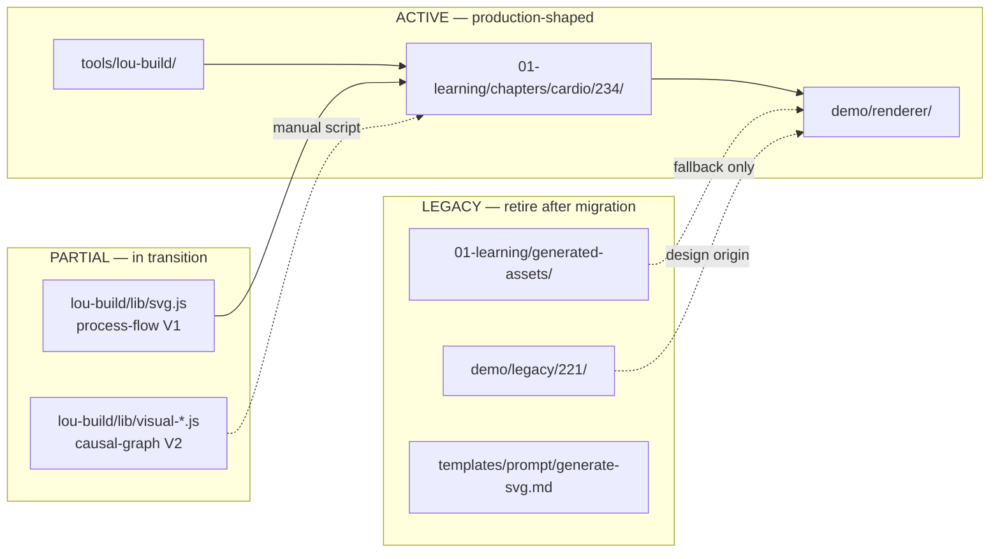
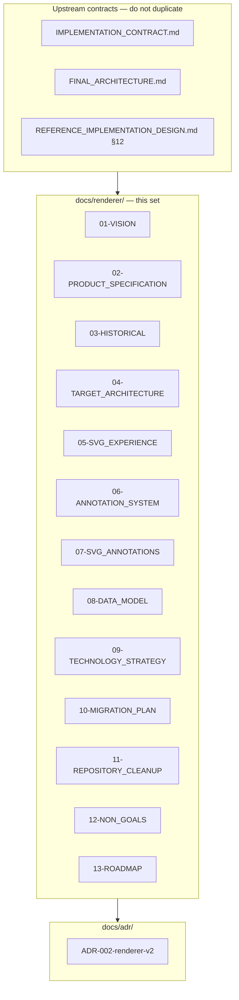
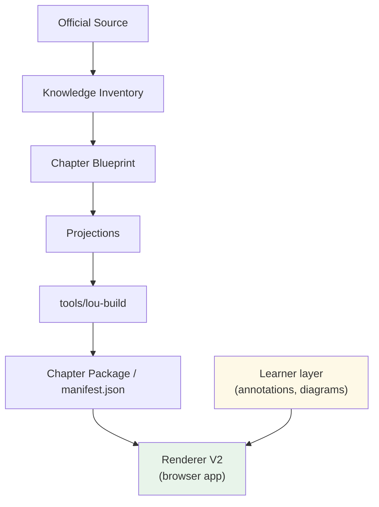

# Lou Médecine — Renderer V2

> **Status:** Authoritative reference (2026-07-26)  
> **Scope:** Browser educational application — navigation, reading, SVG display, annotations, learner layer  
> **Governed by:** `IMPLEMENTATION_CONTRACT.md` Part B, C.7–C.9; subordinate to `FINAL_ARCHITECTURE.md`. V2 text-selection annotations extend the learner layer ([06-ANNOTATION_SYSTEM.md](./06-ANNOTATION_SYSTEM.md), [08-DATA_MODEL.md](./08-DATA_MODEL.md)) without merging C.8/C.9; they are governed by this document set until the contract is formally extended.

This document set is the official reference for the Lou Médecine renderer, in the same role that [`VISUAL_GRAMMAR_LIBRARY.md`](../../VISUAL_GRAMMAR_LIBRARY.md) plays for the SVG grammar. It explains where the renderer comes from, where it stands today, where it is going, and how to get there without architectural drift.

---

## Architecture de référence (gelée v1)

Les documents **14–19** constituent l'architecture officielle gelée du projet (2026-07-28). Index parent : [`contracts/00-INDEX.md`](../contracts/00-INDEX.md) § 6.

**Chaîne documentaire :** [contrats 01–06](../contracts/00-INDEX.md) → [14](./14-LOU-READER-ARCHITECTURE.md) → [15](./15-READER-FUNCTIONAL-SPECIFICATION.md) → [17](./17-PUBLICATION-MODEL.md) → [18](./18-BUILD-ARCHITECTURE.md) → [19](./19-BUILD-PIPELINE.md) → [16](./16-CONTENT-TO-READER-ARCHITECTURE.md).

**État courant du projet :** voir [`PROJECT_STATE.md`](../PROJECT_STATE.md). Outil de build : [`tools/lou-build/`](../../tools/lou-build/) — CLI typée unique, conforme au [doc 19](./19-BUILD-PIPELINE.md).

---

## Document map

| Document | Purpose |
|---|---|
| [01-VISION.md](./01-VISION.md) | Product philosophy — what the renderer is and is not |
| [02-PRODUCT_SPECIFICATION.md](./02-PRODUCT_SPECIFICATION.md) | Complete learner experience, immutability invariant, navigation |
| [03-HISTORICAL_ARCHITECTURE.md](./03-HISTORICAL_ARCHITECTURE.md) | Current and legacy implementations — how they work and why |
| [04-TARGET_ARCHITECTURE.md](./04-TARGET_ARCHITECTURE.md) | Reference technical architecture — components, data flow, diagrams |
| [05-SVG_EXPERIENCE.md](./05-SVG_EXPERIENCE.md) | Generated vs manual SVGs, responsive behaviour, zoom |
| [06-ANNOTATION_SYSTEM.md](./06-ANNOTATION_SYSTEM.md) | Text selection annotations — philosophy and technology |
| [07-SVG_ANNOTATIONS.md](./07-SVG_ANNOTATIONS.md) | Long-term SVG overlay annotation philosophy |
| [08-DATA_MODEL.md](./08-DATA_MODEL.md) | Lightweight annotation and learner-layer data model |
| [09-TECHNOLOGY_STRATEGY.md](./09-TECHNOLOGY_STRATEGY.md) | Stack choices, dependencies, trade-offs |
| [10-MIGRATION_PLAN.md](./10-MIGRATION_PLAN.md) | Incremental path from today to target — KEEP/MOVE/LEGACY |
| [11-REPOSITORY_CLEANUP.md](./11-REPOSITORY_CLEANUP.md) | Final directory organisation and obsolete file retirement |
| [12-NON_GOALS.md](./12-NON_GOALS.md) | Explicit scope boundaries |
| [13-ROADMAP.md](./13-ROADMAP.md) | Realistic implementation phases |
| [14-LOU-READER-ARCHITECTURE.md](./14-LOU-READER-ARCHITECTURE.md) | **Baseline v1.0** — Vision pédagogique, principes, architecture trois couches, glossaire, non-objectifs |
| [15-READER-FUNCTIONAL-SPECIFICATION.md](./15-READER-FUNCTIONAL-SPECIFICATION.md) | **Baseline v1.0** — Spécification fonctionnelle : écrans, interactions, parcours, QCM, Notes, couche apprenante |
| [16-CONTENT-TO-READER-ARCHITECTURE.md](./16-CONTENT-TO-READER-ARCHITECTURE.md) | **Référence conceptuelle** — Frontière Chapter Package publié ↔ Reader : composition, identités, interdictions |
| [17-PUBLICATION-MODEL.md](./17-PUBLICATION-MODEL.md) | **Référence conceptuelle — La Fabrique** — Modèle de publication : état, garanties, incomplétude, manifest |
| [18-BUILD-ARCHITECTURE.md](./18-BUILD-ARCHITECTURE.md) | **Référence conceptuelle — La Fabrique** — Architecture de fabrication : transformations, validations, invariants |
| [19-BUILD-PIPELINE.md](./19-BUILD-PIPELINE.md) | **Ingénierie — La Fabrique** — Pipeline opérationnel : étapes, artefacts, validations, dépendances |
| [ADR-002](../adr/ADR-002-renderer-v2-architecture.md) | Architecture Decision Record — why V2 exists |

---

## Phase 1 — Repository audit summary

### What exists today

The repository contains **three distinct concerns** that are often conflated under "renderer":

| Concern | Location | Role |
|---|---|---|
| **Browser application** | `demo/renderer/` | Assembles the learner experience from manifests |
| **Chapter build tool** | `tools/lou-build/` | Validates, packages, generates manifest and SVGs |
| **SVG generation** | `tools/lou-build/lib/svg.js` (V1) + `visual-*.js` (V2) | Deterministic diagram output — *not* the browser app |

Only `demo/renderer/` is the **educational renderer**. The SVG modules in `lou-build` are **build-time visual renderers** consumed by the packaging pipeline.

### Authoritative implementation today

**The browser renderer in `demo/renderer/` is authoritative.** It is manifest-driven, chapter-agnostic, contract-tested, and serves Item 234 understanding v1 (four published projections). It is **Renderer V1 implemented**, not a throwaway prototype.

**Renderer V2** is not a second codebase. It is the **evolution** of this application toward the full product specification documented here: rich text annotations, SVG overlay annotations, improved reading experience, and retirement of legacy fallbacks — while preserving the architectural invariants already ratified in `IMPLEMENTATION_CONTRACT.md`.

### SVG pipeline authority

Two parallel SVG pipelines coexist:

| Pipeline | Trigger | Primitives | Status |
|---|---|---|---|
| **V1** (`svg.js`) | `lou-build build` | `process-flow` only | ACTIVE but transitional — hard-coded coordinates, chapter-specific strings |
| **V2** (`visual-spec.js` → `visual-render.js`) | Manual `render-visual-specs.mjs` | `causal-graph` only | EXPERIMENTAL — not wired into build; schema not ratified |

**Authoritative direction:** V2 visual-spec pipeline per `VISUAL_GRAMMAR_CONTRACT.md`. V1 remains operational until V2 is integrated into `lou-build build` and covers required primitives incrementally.

### Duplication and drift

| Duplication | Resolution |
|---|---|
| `demo/legacy/221/` vs `demo/renderer/` | Legacy is visual design origin only; renderer superseded it |
| `generated-assets/` vs `chapters/` | Generated-assets is fallback corpus; chapters/ is authoritative |
| `config.js` `TABS` vs manifest tabs | TABS is legacy fallback; manifest is authoritative |
| `svg.js` vs `visual-render.js` | V1 transitional; V2 target; merge when build integrates V2 |
| Root docs (`ARCHITECTURE_AUDIT.md`, `README.md`) vs current state | Obsolete status claims; superseded by this document set |

### Files that should eventually disappear

See [10-MIGRATION_PLAN.md](./10-MIGRATION_PLAN.md) and [11-REPOSITORY_CLEANUP.md](./11-REPOSITORY_CLEANUP.md) for the full classification. Summary:

- `demo/legacy/` — after design tokens are fully absorbed
- `01-learning/generated-assets/cardio/234-*` — after all chapters have built manifests
- `tools/lou-build/lib/svg.js` — after V2 pipeline covers `process-flow` and build integrates V2
- `demo/renderer/config.js` `TABS` registry — after fallback path is removed
- Obsolete root status documents — after README is updated to point here

---

## Phase 2 — Documentation strategy

### Where renderer documentation lives

**Decision:** `docs/renderer/` is the authoritative home for renderer documentation.

**Justification:**

1. **Scalability.** The renderer requires a multi-document set (vision, product spec, architecture, migration, ADR, roadmap). A single file would exceed maintainability limits — unlike the grammar library, which is a catalogue with stable boundaries.

2. **Consistency with ADRs.** Architecture decisions live in `docs/adr/` (see ADR-001 for the grammar freeze). Renderer ADR-002 sits alongside; detailed specs sit in `docs/renderer/`.

3. **Separation from upstream architecture.** `FINAL_ARCHITECTURE.md`, `IMPLEMENTATION_CONTRACT.md`, and `REFERENCE_IMPLEMENTATION_DESIGN.md` govern the whole system. They define renderer *obligations* (C.7–C.9); this folder defines renderer *implementation and product*.

4. **Avoiding root clutter.** Root already holds cross-cutting contracts (`VISUAL_GRAMMAR_*`, `IMPLEMENTATION_CONTRACT.md`). Renderer-specific detail belongs in a dedicated namespace.

5. **Avoiding orphan stubs.** `03-architecture/README.md` is empty. Rather than populate a generic architecture folder, renderer docs are co-located and cross-linked from `demo/renderer/README.md`.

### Existing renderer-related documents — classification

| Document | Classification | Action |
|---|---|---|
| `docs/renderer/*` (this set) | **AUTHORITATIVE** | Maintain as SoT for renderer |
| `demo/renderer/README.md` | **OPERATIONAL** | Keep — quick start for developers; link to `docs/renderer/` |
| `IMPLEMENTATION_CONTRACT.md` C.7–C.9 | **AUTHORITATIVE (upstream)** | Keep — contractual obligations; do not duplicate |
| `REFERENCE_IMPLEMENTATION_DESIGN.md` §12 | **AUTHORITATIVE (upstream)** | Keep — renderer target contract |
| `FINAL_ARCHITECTURE.md` §5 Renderer | **AUTHORITATIVE (upstream)** | Keep — system-level role |
| `ARCHITECTURE_AUDIT.md` | **OBSOLETE** | Superseded — claims renderer never loads SVGs; retain as historical forensic record only |
| `PRODUCTION_ARCHITECTURE.md` | **LEGACY** | Superseded by `FINAL_ARCHITECTURE.md`; retain for history |
| `VISUAL_SPEC_V0_1_EXPERIMENT.md` | **EXPERIMENTAL** | Keep in root — records V2 SVG experiment; link from 05-SVG_EXPERIENCE |
| `05-research/RESEARCH_LOG.md` Session 002 | **EVIDENCE** | Keep — learner-layer research; cited by annotation docs |
| `05-research/VISUAL_GRAMMAR_AUDIT.md` | **EVIDENCE** | Keep — not renderer docs |

---

## Phase 3 — Official document set structure

The renderer documentation is organised into **layers**, mirroring how `VISUAL_GRAMMAR_CONTRACT.md` (governance) and `VISUAL_GRAMMAR_LIBRARY.md` (catalogue) relate:

**Why not a single file?** The renderer spans product philosophy, UX specification, technical architecture, migration engineering, and explicit non-goals. These audiences and update frequencies differ. A contributor fixing annotation anchoring should not scroll past repository audit history. An ADR must remain immutable once accepted.

**Why an ADR separate from architecture?** ADR-002 records the *decision* and its trade-offs. `04-TARGET_ARCHITECTURE.md` records the *resulting design*. Decisions are frozen; architecture may evolve in detail within ADR constraints.

---

## Quick orientation for new contributors

| Question | Answer |
|---|---|
| Where does the renderer live? | `demo/renderer/` today → `apps/renderer/` after migration ([11-REPOSITORY_CLEANUP.md](./11-REPOSITORY_CLEANUP.md)) |
| Which implementation is authoritative? | `demo/renderer/` — manifest-driven, tested |
| Which code is legacy? | `demo/legacy/`, `generated-assets/` fallback, `config.js` TABS |
| Which code is experimental? | V2 visual-spec pipeline (`visual-*.js`), not yet in build |
| Where should future development happen? | Evolve `demo/renderer/` in place until migration renames to `apps/renderer/` |
| How do I run it? | `python3 -m http.server 8765` → `demo/renderer/index.html?chapter=cardio/234` |
| What are the tests? | `cd demo/renderer && npm test` |

---

## Relationship to other system components

The renderer consumes **only** the chapter package. It never reads Inventory, Blueprint, or source directly. The learner layer is stored independently and merged at display time.
